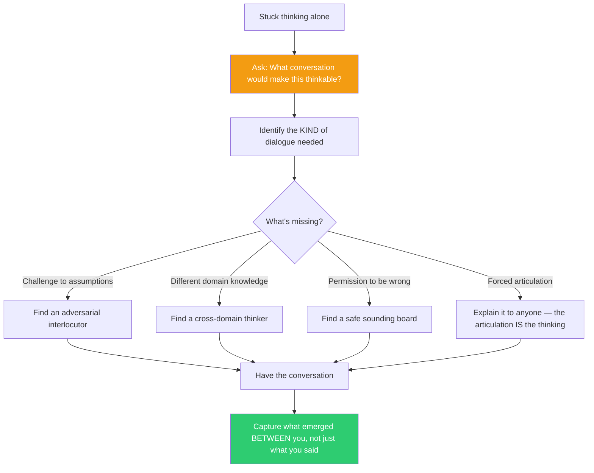

## The Move

Stop trying to think harder. Instead ask: "What conversation would make this thinkable?" Not "who should I ask for help" — that frames communication as a patch for individual failure. Ask instead what KIND of dialogue is missing. Would a conversation with {{persona.1}} open one dimension — perhaps by challenging your assumptions? Would a debate with {{persona.2}} open another — perhaps by forcing you to defend choices you have left vague? Name the conversation you need, then go have it. The thought you cannot reach alone is not a sign of insufficient intelligence — it is a thought that exists in the space between minds and cannot be produced by one mind alone.

## When to Use

- You have been solo-thinking for more than an hour on something that refuses to crystallize
- You notice that explaining the problem to someone (even a rubber duck) changes your understanding of it — that change IS the thinking, not a side effect
- The problem involves multiple stakeholders or perspectives and you are trying to hold all of them in your own head
- You have written notes, drawn diagrams, and listed options but still feel like the core insight is just out of reach

## Diagram

## Example

**Situation:** You are the tech lead designing the architecture for a new event-driven system. You have been sketching diagrams alone for two days. You have three candidate architectures (Kafka-based, NATS-based, and a custom pub/sub over Redis). You can list pros and cons of each but cannot commit. Every time you lean toward one, you see a flaw. You feel like you need more research.

**Apply the move:** "What conversation would make this thinkable?"

- You do not need more research. You need an interlocutor who will force you to defend a choice. The thought "which architecture is right" cannot be completed alone because the decision depends on tradeoffs that only become visible under pressure.
- You set up a 30-minute call with a senior engineer and say: "I'm going to argue for Kafka. Your job is to tear it apart." In minute 12, while defending Kafka's partitioning model, you hear yourself say "well, we don't actually need ordering guarantees across topics because..." and you stop. That sentence — which you could not have produced alone — reveals that your implicit assumption (strong ordering is required) was wrong. With that assumption gone, the NATS architecture becomes obviously correct.
- The insight did not come from either person. It came from the conversation. It lived between minds.

## Watch Out For

- This is not "ask for help." Asking for help assumes someone else has the answer. This move assumes the answer does not exist yet and will be produced by the interaction itself
- Choosing the wrong kind of conversation is worse than thinking alone. If you need challenge and you get sympathy, you will feel better but not think better. Be specific about what kind of dialogue you need
- Remote and async communication (Slack, email) is communication but often not the kind that produces new thought. Synchronous, real-time dialogue with genuine back-and-forth is usually what is needed
- If no interlocutor is available, simulate the conversation: write a dialogue between yourself and an imagined adversary. It is less powerful but better than continued solo rumination
