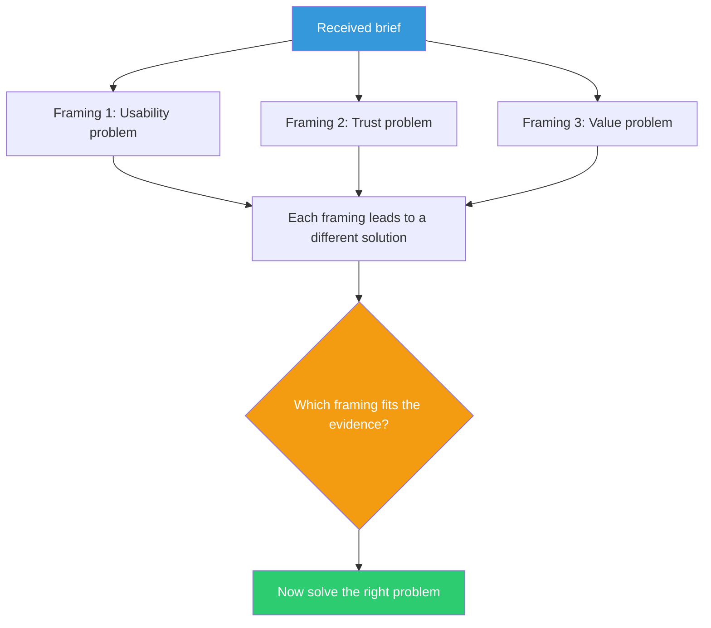

## The Move

Before solving anything, write three genuinely different versions of the problem statement. Not three wordings of the same problem — three different *framings* that would lead to different solutions.

The way you frame a problem determines the solution space you search. Most of the time, you inherit one framing (from the user, the ticket, the brief) and never question it. But the framing is a choice, and it's often the most consequential choice in the entire process.

## When to Use

- At the very start of a task, before any solution work
- When you receive a brief or spec and your mind immediately jumps to an approach
- When the problem feels obvious — that's often a sign you've accepted a framing uncritically

## Diagram

## Example

**Brief:** "Our API is too slow."

**Framing 1 — Performance problem:** The code is inefficient. Profile, find bottlenecks, optimize hot paths.

**Framing 2 — Architecture problem:** The system isn't designed for this load pattern. No amount of optimization fixes a fundamentally wrong architecture.

**Framing 3 — Expectations problem:** The API is fine; the caller's expectations are wrong. Maybe the real fix is making the operation async, adding a progress indicator, or caching results client-side.

Each framing leads you to a different part of the codebase, a different set of tools, and a different definition of "done."

## Watch Out For

- The three framings should be *genuinely different*, not surface rewording. "Users find checkout confusing" and "The checkout UX is bad" are the same framing
- You don't need to solve all three — the goal is to *choose* a framing deliberately rather than inheriting one by default
- Sometimes the first framing is correct. That's fine. But you should be able to articulate *why* it's correct and what you'd do differently under the other framings
