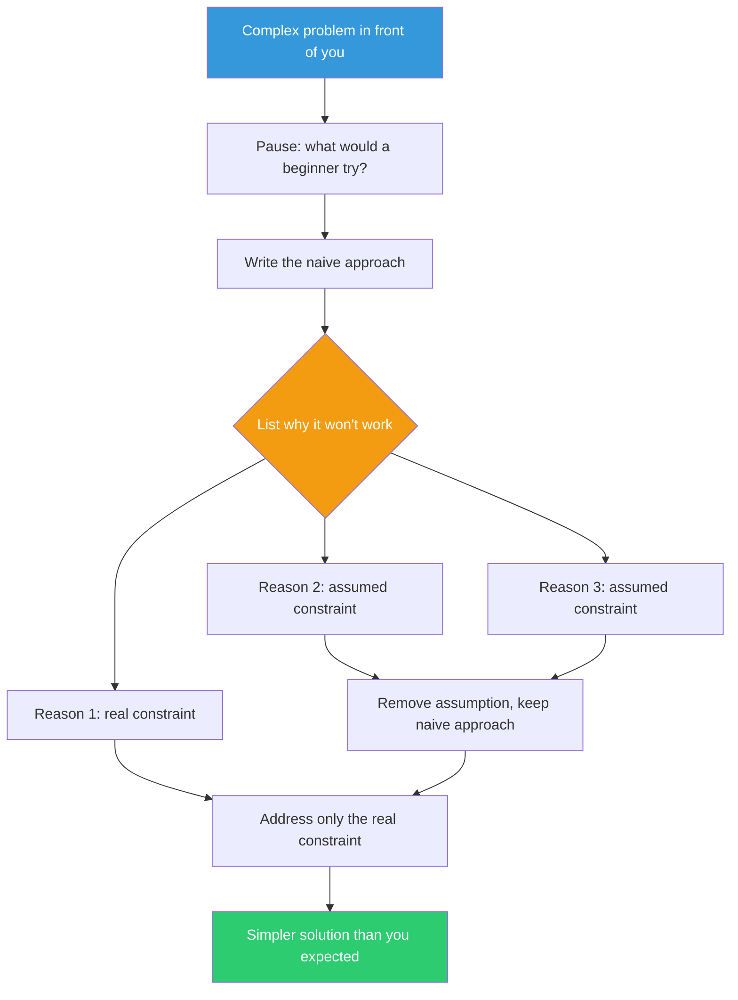

## The Move

Imagine {{persona.1}} encountered this problem for the first time. Write down, concretely, what they would try. Not what they *should* try, but what they *would* try: the naive, obvious, possibly embarrassing approach. Then ask: why won't that work? Write down the specific reasons. Each reason is an assumption worth examining — some of them are load-bearing, and some are not.

## When to Use

- When you've been deep in a domain and your solutions keep getting more elaborate
- When the simplest approach feels "too simple" but you can't articulate why
- When you notice yourself reaching for abstractions before you've solved the concrete case
- When a junior team member's suggestion gets dismissed and you want to pressure-test why

## Diagram

## Example

**Task:** Build a feature flag system for a growing microservices platform.

**Expert instinct:** Distributed configuration store, real-time propagation via event bus, percentage-based rollouts, user segmentation, audit logging, admin UI.

**Beginner approach:** A JSON file with flag names and true/false values. Each service reads it on startup.

**Why won't that work?**
1. "Flags need to update without redeployment" — Real constraint. But: read the file every 30 seconds instead of only at startup. Still simple.
2. "We need percentage rollouts" — Do we? Right now we have 12 flags and they're all on or off. This is a future need, not a current one.
3. "A JSON file isn't scalable" — We have 4 services. A JSON file is fine for 4 services.
4. "We need an admin UI" — The team is 6 engineers. They can edit JSON.

The beginner's approach, plus a periodic reload, solves the actual problem today. The expert's approach solves problems that don't exist yet.

## Watch Out For

- This is not anti-expertise. The goal is to separate genuine constraints from habitual complexity. Sometimes the expert approach is correct — but you should be able to list the specific reasons why the naive approach fails
- Don't strawman the beginner. Write down what a *reasonable* newcomer would try, not the worst possible approach
- If you can't articulate concrete reasons why the simple approach fails, that's a strong signal it might actually work
