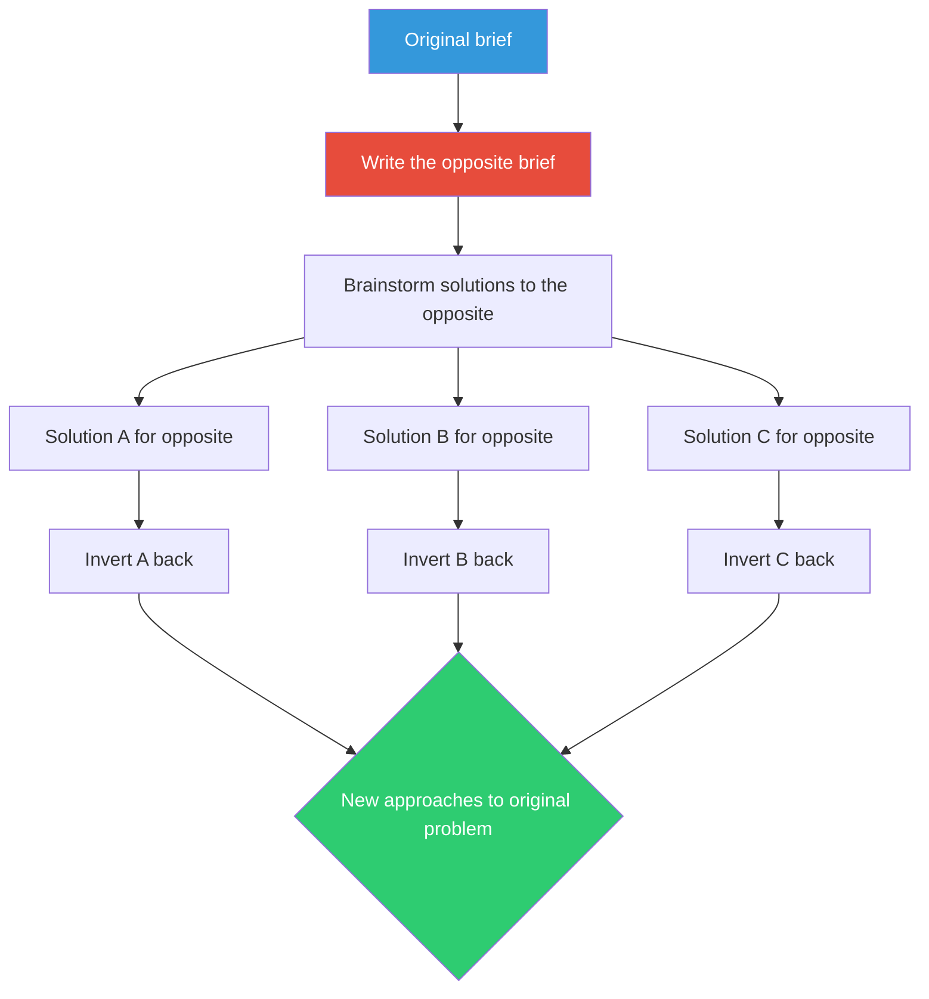

## The Move

Take your goal and write its precise opposite. Not a vague negation — a specific, concrete brief for achieving the reverse outcome. Then brainstorm solutions to *that* reversed brief seriously, as if it were your real assignment. Write down at least three approaches. Finally, invert each solution back: if doing X would make the problem worse, then *preventing* or *reversing* X might be exactly what you need. Now look at the word "{{word.1}}" — does it suggest a third brief that's neither the original nor its opposite?

## When to Use

- When your brainstorming keeps producing variations of the same idea
- When you feel too close to the problem to see it from a new angle
- When the problem is about preventing something (errors, churn, confusion) — reversals work especially well here
- When you want to uncover hidden assumptions about what "good" looks like

## Diagram

## Example

**Original brief:** "Reduce the number of bugs in our release process."

**Opposite brief:** "How would we *maximize* the number of bugs that reach production?"

**Solutions to the opposite:**
1. **Skip code review entirely.** Let every commit go straight to main.
2. **Deploy on Fridays at 5pm.** No one is around to catch issues.
3. **Never write tests for edge cases.** Only test the happy path.
4. **Make the staging environment different from production.** Use different OS versions, different data shapes, different config.
5. **Let anyone deploy anything at any time** with no coordination or changelog.

**Invert back:**
1. We actually *do* have code review, but it's a rubber stamp. The real fix isn't "more review" — it's making review meaningful (checklists, size limits, required context).
2. We *do* deploy late on Fridays sometimes. Simple policy change: freeze deployments after 3pm Thursday.
3. We write tests, but almost none for edge cases. Mandate at least one edge-case test per PR.
4. Our staging *is* different from prod. That's a known problem we keep deprioritizing. Maybe it's the highest-leverage fix.
5. We have no deployment coordination. A shared deploy queue would catch conflicts.

Notice how the reversal surfaced the staging-prod divergence as a top issue — something that might never come up in a direct brainstorm about "reducing bugs."

## Watch Out For

- The opposite brief needs to be specific and actionable, not just a negation. "Make users unhappy" is too vague. "Design an onboarding flow that makes users abandon signup" is useful
- Take the reversal seriously. If you treat it as a joke exercise, you'll get joke answers
- Some inversions don't flip cleanly — that's fine, discard those and keep the ones that reveal something new
