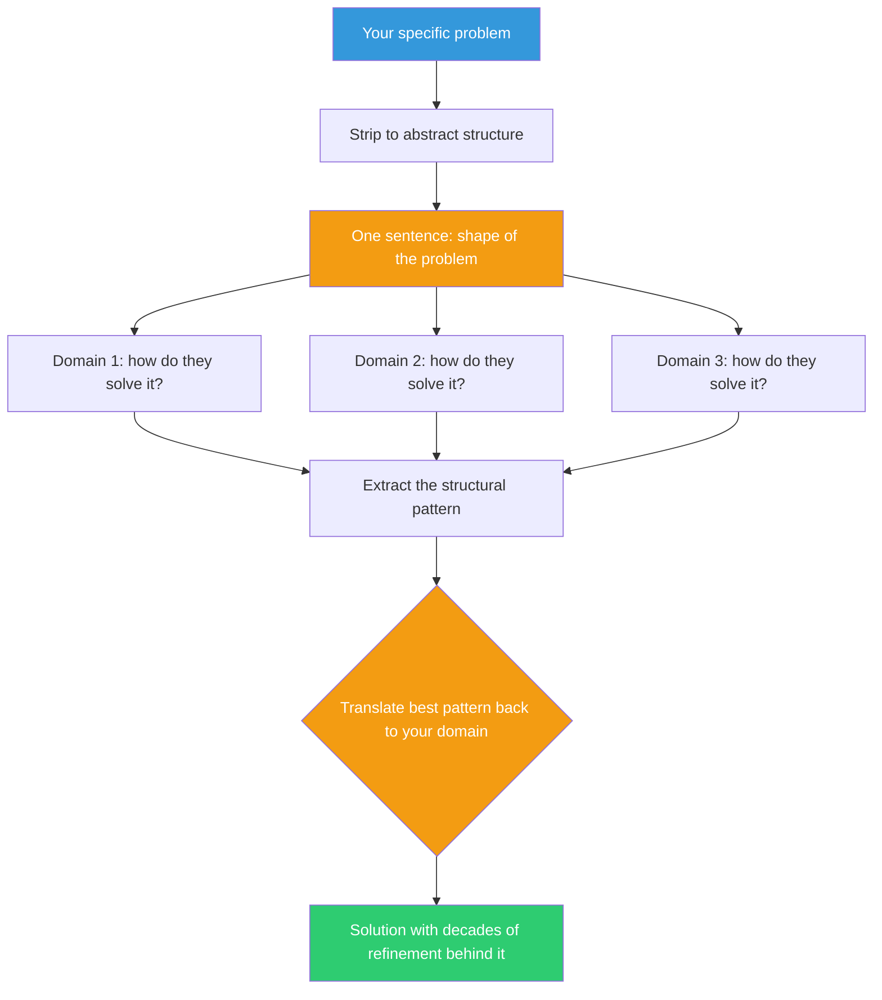

## The Move

Search {{domain.1}} and {{domain.2}} for structurally similar problems. Strip your problem down to its abstract structure: ignore the domain, the technology, and the specifics. Write one sentence describing the *shape* of the problem — what goes in, what comes out, what constraint makes it hard. Then list 3-5 other domains where that same shape appears. For each domain, research how they solved it. Look for the structural match, not the surface match. Translate the most promising solution back into your domain.

## When to Use

- When you're building something that feels fundamental enough that someone must have solved it before
- When your domain is specialized but the underlying problem is generic (scheduling, matching, ranking, conflict resolution)
- When you've been iterating on a solution and it keeps getting more complex — a sign you may be missing a known pattern
- When you're early in a project and want to survey the solution landscape before committing

## Diagram

## Example

**Your problem:** "We need to assign incoming support tickets to agents based on skill, availability, and priority, while keeping wait times low and workload balanced."

**Abstract structure:** "Assign arriving items to heterogeneous processors under constraints, minimizing wait time and balancing load."

**Who else has this shape?**

1. **Operating systems (process scheduling):** Decades of research on assigning processes to CPU cores. Solutions include priority queues, round-robin, work-stealing, and completely fair scheduling. Linux's CFS scheduler balances fairness and throughput using a red-black tree of virtual runtimes.

2. **Emergency rooms (triage):** Patients arrive unpredictably with different urgency levels. ER triage uses a severity classification (ESI levels), fast-track lanes for simple cases, and dynamic reassignment when capacity changes.

3. **Ride-sharing (dispatch):** Uber/Lyft match riders to drivers in real-time based on proximity, driver rating, and ride type. They use a two-phase approach: first narrow candidates by hard constraints (distance, vehicle type), then rank by soft preferences (rating, ETA).

**Translated back:** Use the ride-sharing two-phase model. Phase 1: filter agents by hard constraints (has the required skill, is currently online, not at capacity). Phase 2: rank remaining agents by soft factors (current load, expertise level, recent idle time). This is simpler than building a full scheduler and handles the 90% case. Add a "fast-track lane" from ER triage for password resets and known-answer tickets — route them to a bot or junior pool, keeping senior agents free.

## Watch Out For

- The analogy must be structural, not surface-level. "Both involve users" is not a useful match. "Both involve assigning heterogeneous tasks to heterogeneous resources under real-time constraints" is
- Don't force the translation. If the best solution from another domain doesn't map cleanly, that's useful information — your problem may have a constraint that makes it genuinely different
- This move takes real research time. It's "deep" effort. Don't use it for problems where a quick Stack Overflow search would suffice
- Beware of borrowing complexity you don't need. An OS scheduler handles millions of processes per second; your ticket system handles hundreds per day. Take the *idea*, not the full implementation
