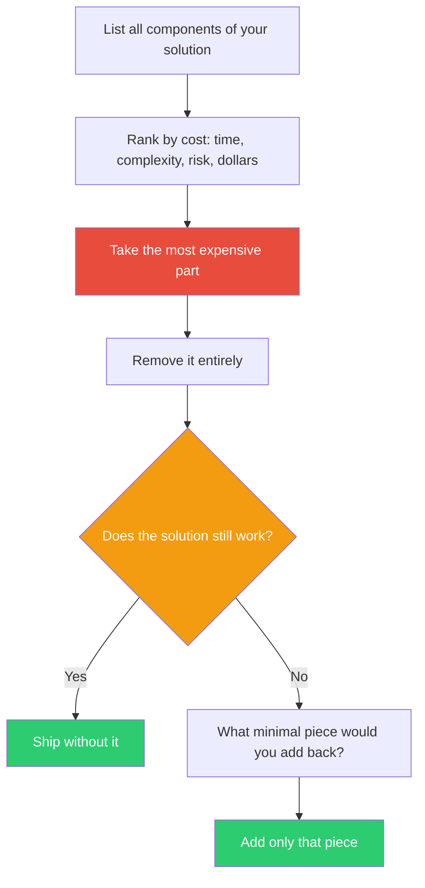

## The Move

List every component of your current solution. For each one, estimate its cost — in implementation time, ongoing complexity, risk, or literal dollars. Rank them. Take the most expensive one and remove it completely. Don't replace it with something cheaper — just delete it. Now ask: does the remaining solution still solve the core problem? If yes, you were carrying dead weight. If no, ask what minimal thing you'd need to add back. That minimal thing is almost always cheaper than what you removed.

## When to Use

- Your solution has grown complex and you suspect not all of it is load-bearing
- One component dominates the cost, timeline, or risk of the whole project
- You inherited a design and want to question its assumptions
- You're over budget and need to cut scope without losing the core value

## Diagram

## Example

**Problem:** "We're building a real-time collaborative document editor."

**Component list, ranked by cost:**

1. **Real-time sync engine (CRDT/OT)** — 60% of the engineering effort, highest risk
2. Permissions system — 15%
3. Document storage and versioning — 15%
4. UI editor component — 10%

**Remove the most expensive part:** Delete the real-time sync engine entirely.

**Does it still work?** Users can still create, edit, save, and share documents. They just can't see each other's cursors live.

**What's the minimal add-back?** A simple polling mechanism that refreshes the document every 5 seconds, plus a lock indicator showing "Alice is editing Section 3." That covers 80% of the collaboration need at 5% of the original cost.

**What we learned:** The team assumed real-time sync was the product. It wasn't. The product was collaborative editing — and most collaboration is asynchronous anyway.

## Watch Out For

- Don't confuse "expensive" with "valuable." Sometimes the expensive part IS the core differentiator. The move is to test that assumption, not to blindly cut
- This works best when the expensive part was added because "that's how everyone does it" rather than from first-principles reasoning
- If removing the part breaks the solution, resist the urge to put the whole thing back. The minimal add-back is the key insight
- Run this move early, before you've sunk cost into the expensive part. Sunk cost makes it psychologically harder to delete
