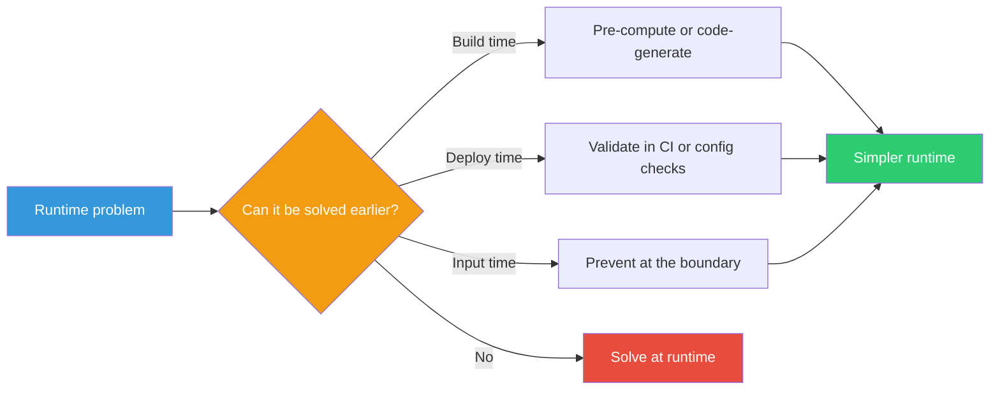

## The Move

Take the problem you're solving and ask: when does this complexity actually need to be resolved? For each piece of logic, check whether it can be moved to an earlier phase — build time, deploy time, startup, configuration, or onboarding. For each runtime decision, ask: could this have been a build-time decision? For each runtime validation, ask: could this have been prevented at input time? For each runtime computation, ask: could this have been pre-computed and cached? Move as much as possible upstream. The earlier you resolve complexity, the simpler everything downstream becomes.

## When to Use

- Runtime logic is growing tangled with special cases and conditionals
- You're repeatedly computing the same thing on every request
- Errors keep slipping through to production that could have been caught at build or deploy time
- Your system handles complexity that users or operators could resolve upfront during configuration

## Diagram

## Example

**Problem:** "Our API gateway routes requests to different backend services based on URL patterns, user roles, feature flags, and A/B test groups. The routing logic has 200+ conditional branches and keeps breaking."

**Solve it in advance:**

- **URL patterns** don't change at runtime. Generate a compiled routing table at deploy time from a declarative config file. Zero runtime parsing.
- **User roles** are known at login. Compute the user's effective permissions once at authentication and stamp them into the session token. No per-request role lookups.
- **Feature flags** change infrequently. Evaluate them every 30 seconds and cache the result. Each request reads a flat lookup instead of evaluating flag rules.
- **A/B test groups** are assigned per user. Compute the assignment at signup and store it. No per-request randomization.

**Result:** The 200-branch runtime router becomes a flat table lookup. The complexity didn't disappear — it moved to build time, deploy time, and login time, where it's easier to test, debug, and reason about.

## Watch Out For

- Pre-computation assumes inputs are known in advance. If the inputs are truly dynamic and unpredictable, this move doesn't apply
- Moving complexity to build time means changes require a build/deploy cycle. Make sure that tradeoff is acceptable for your rate of change
- Don't over-cache. If the pre-computed result can go stale and staleness has consequences, you need an invalidation strategy — which is its own complexity
- This is not "premature optimization." It's about choosing the right phase for each decision. Only apply it to complexity you've already identified as painful
