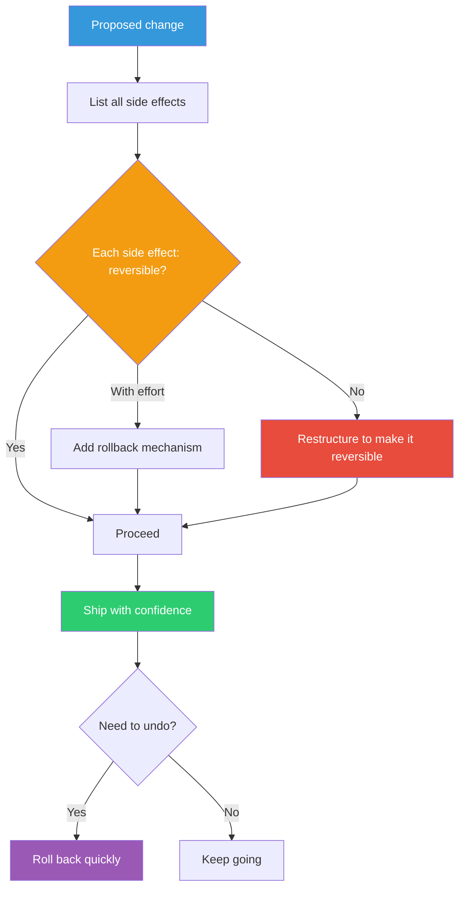

## The Move

For the decision or change you're about to make, answer one question: how would I undo this in under an hour? If you can't answer that, stop and build the undo mechanism first. Concretely: list every side effect of the change (data mutations, external API calls, user-visible state changes, contractual commitments). For each side effect, classify it as reversible, reversible-with-effort, or irreversible. For anything not easily reversible, add a specific mechanism: a feature flag, a database migration with a down path, a soft-delete instead of hard-delete, a shadow mode before full launch. Only then proceed with the change.

## When to Use

- You're about to make a decision that's hard to walk back (schema migration, public API change, pricing change)
- The team is stuck in analysis paralysis because the stakes of being wrong feel too high
- You want to move fast but the blast radius of a mistake is large
- You're launching something new and want the ability to learn and adjust without a fire drill

## Diagram

## Example

**Problem:** "We want to migrate our user table from MySQL to PostgreSQL, but if something goes wrong, we're stuck."

**List side effects:**
1. All reads come from PostgreSQL (reversible — point reads back to MySQL)
2. All writes go to PostgreSQL (reversible-with-effort — need dual-write or sync)
3. MySQL data goes stale once writes stop (irreversible after data diverges)

**Make it reversible:**
- **Phase 1:** Dual-write to both databases. Reads still from MySQL. Undo: turn off dual-write.
- **Phase 2:** Switch reads to PostgreSQL. Dual-write continues. Undo: point reads back to MySQL.
- **Phase 3:** Run for two weeks. Compare query results between both databases to verify correctness. Undo: still possible, MySQL is in sync.
- **Phase 4:** Stop writing to MySQL. This is the first irreversible step — only take it after Phase 3 proves correctness.

**Result:** A scary, big-bang migration becomes four small, reversible steps. The team ships Phase 1 within a week instead of debating the migration plan for a month.

## Watch Out For

- Reversibility has a cost. Don't gold-plate undo mechanisms for trivially low-risk changes. Focus on decisions with high blast radius
- "Reversible" doesn't mean "consequence-free." If you ship a broken feature to 1M users and roll it back in 5 minutes, those users still had a bad experience. Pair reversibility with incremental rollout
- Some decisions are genuinely irreversible (public announcements, legal commitments, physical deployments). For those, this move tells you to slow down and get them right, not to pretend they're reversible
- Feature flags are the most common reversibility tool, but flag debt is real. Have a plan to clean them up
