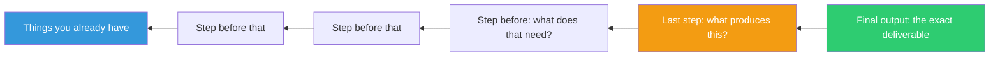

## The Move

Describe the final output as if it were {{genre.1}} — then trace backwards. Write down the *exact* final output. Not a description of it — the actual thing. If it's an API response, write the JSON. If it's a report, sketch the page with real numbers. If it's a CLI tool, write the terminal session showing the command and its output. Now look at that output and ask: what is the last transformation that produces this? Write that down. Then ask: what does *that* step need as input? Keep going until you reach things you already have. The chain from existing inputs to final output is your plan.

## When to Use

- At the start of a project when requirements feel abstract or sprawling
- When you notice yourself building "supporting infrastructure" before the actual deliverable
- When you've been working for a while and lost track of what the end product looks like
- When multiple people are working on a task and need a shared, concrete definition of done

## Diagram

## Example

**Task:** "Build a dashboard showing team velocity."

**Step 1 — Write the exact output:**
A web page with a line chart. X-axis: last 8 sprints. Y-axis: story points completed. One line per team. A table below with columns: Team, Avg Velocity, Trend (up/down/flat), Sprint Commitment vs Actual.

**Work backwards:**

- **To render that page:** Need a React component that takes an array of `{ team, sprint, pointsCompleted, pointsCommitted }` objects.
- **To get that data array:** Need an API endpoint `GET /api/velocity?teams=A,B&sprints=8` that returns that shape.
- **To serve that endpoint:** Need a query that joins the sprints table with the tickets table, grouped by team and sprint, summing points where status = done.
- **To run that query:** Need the database to have a `sprints` table and a `tickets` table with a `sprint_id` foreign key and a `points` column.
- **Do we have those tables?** Yes — they already exist in the project tracker database.

**The plan, forward:** Write the SQL query. Wrap it in an API endpoint. Build the chart component. Done. Three concrete steps, no ambiguity about scope.

**What we avoided building:** A generic "metrics framework," a configurable dashboard system, a data pipeline, an abstraction layer over the project tracker. All things that feel productive but aren't required by the actual output.

## Watch Out For

- Be ruthlessly concrete when writing the output. "A dashboard" is not an output. A screenshot sketch with specific charts, labels, and data is an output
- If you can't write the exact output, that's the real problem — you don't yet know what you're building. Fix that first
- This move optimizes for building *only what's needed*. That's usually good, but sometimes you genuinely need to build for extensibility. Decide consciously, not by default
- The backward chain often reveals that you need less than you thought. Resist the urge to add steps back in "just in case"
