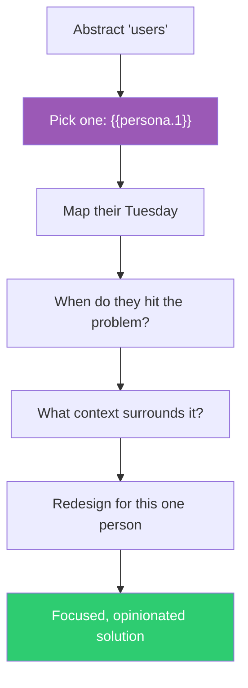

## The Move

Forget your abstract user base. Your user is now exactly one person: **{{persona.1}}**. Answer four questions about them: (1) What does their typical Tuesday look like? (2) At what moment in their day do they encounter this problem? (3) What are they doing right before and right after? (4) What would make them say "finally, someone gets it"?

Now redesign your solution for this one person. Be specific — name the features they'd love, the ones they'd ignore, and the ones that would annoy them. A solution that delights one real person almost always serves a broader audience better than a solution designed for "everyone."

## When to Use

- Requirements are bloated because you're trying to serve every possible user
- The team can't agree on priorities because they're imagining different users
- Your product feels generic and undifferentiated
- You need to cut scope and don't know what to sacrifice

## Diagram

## Example

**Problem:** "We're building a project management tool and can't decide which features to prioritize."

**The persona: {{persona.1}}** — say, a freelance graphic designer.

**Their Tuesday:** Wakes up, checks email for client feedback. Has three active projects. Juggles deadlines set by clients, not by her. Works alone, so there's no team to coordinate with — but she needs to track what she promised to whom and by when. She bills hourly and loses track of time spent per project.

**Redesign for her:**
- Kill the team-collaboration features — she works alone. That's half the backlog gone.
- The core screen should be a timeline of client deadlines, not a kanban board.
- Time tracking should be built in, not a third-party integration.
- "Quick capture" for client requests straight from email matters more than sprint planning.

**Broader insight:** Designing for this one person revealed that the tool was over-indexed on team features and under-indexed on client-deadline and time-tracking workflows — a gap that affects many freelancers and small agencies, not just this one persona.

## Watch Out For

- The persona is a lens, not a cage. After designing for one person, check whether the solution generalizes — but don't generalize too early
- If the randomly selected persona is genuinely irrelevant to your product, re-roll. The persona needs to be at least plausible as a user
- Don't confuse "designing for one person" with "building a product for one customer." You're using specificity to sharpen thinking, not to limit your market
- Resist the urge to immediately add back features for other personas. Sit with the focused version first
