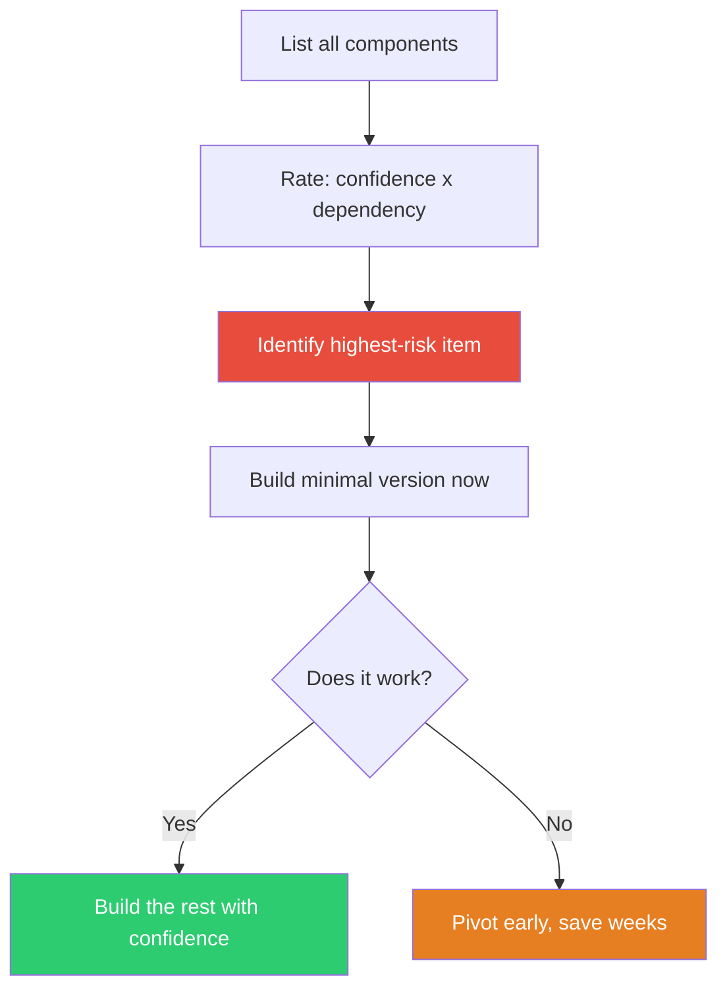

## The Move

List every component or assumption in your plan. For each one, rate two things: (1) how confident are you it will work (1-5), and (2) how much of the project depends on it (1-5). Multiply the scores inversely: low confidence times high dependency equals high risk. Take the highest-risk item and build a minimal version of it — today, before touching anything else.

If the risky part works, everything else is execution. If it doesn't, you've saved all the time you would have spent on the easy parts.

## When to Use

- You have a multi-step plan and aren't sure the whole thing holds together
- You're tempted to start with the familiar, comfortable parts
- The project has a single assumption that, if wrong, invalidates everything
- You've been burned before by discovering a blocker late in a project

## Diagram

## Example

**Plan:** Build a mobile app that uses the phone's camera to identify plants, shows care instructions, and lets users track their garden.

**Components rated:**

| Component | Confidence | Dependency | Risk |
|---|---|---|---|
| Camera UI | 4 | 2 | Low |
| Plant identification ML model | 2 | 5 | **High** |
| Care instructions database | 4 | 3 | Medium |
| Garden tracker | 5 | 1 | Low |
| User accounts | 5 | 2 | Low |

**Highest risk:** The plant identification model. Confidence is low (can it identify 500+ species accurately from phone photos?) and everything depends on it (if it can't identify plants, the app is useless).

**The spike:** Before building any UI, database, or account system, the team spends two days testing three off-the-shelf ML models against 200 real phone photos of common plants. Results: two models are unusable, one hits 78% accuracy — good enough with a "not sure, here are the top 3" fallback.

**Outcome:** Two days to derisk the entire project. If none of the models worked, they'd have saved months of wasted UI and backend work.

## Watch Out For

- "Riskiest" means most uncertain AND most load-bearing. A risky component that nothing depends on isn't worth spiking first
- The prototype should be minimal — hours or days, not weeks. You're testing feasibility, not building production quality
- Don't confuse "hard" with "risky." Hard things you know how to do are just work. Risky things are the ones where you genuinely don't know if they'll work
- If you can't identify the riskiest part, that's a sign you need to decompose the plan further before building anything
