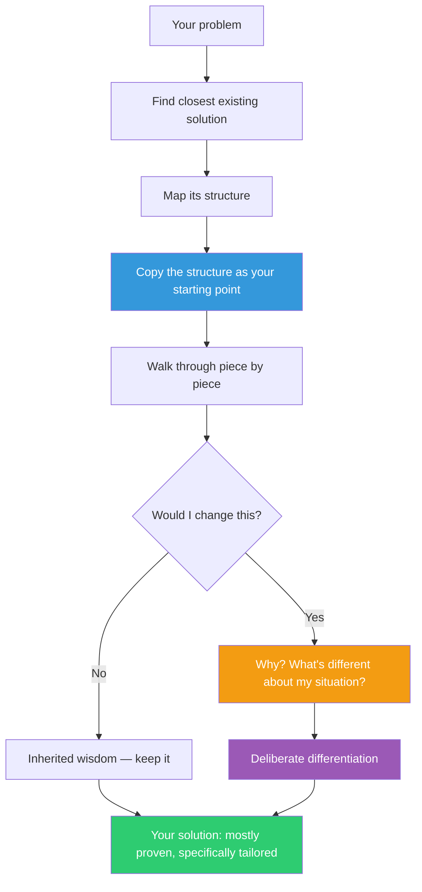

## The Move

Find the closest existing solution to your problem — a competitor's product, an open-source project, a pattern from another codebase, a template from your industry. Map its structure: what are the components, how do they connect, what decisions did the creators make? Now copy that structure on paper or in your head as your starting point. Then go through it piece by piece and ask: "What specifically would I change, and why?" Every change you make must be justified by something concrete about your situation that differs from theirs. What you don't change is inherited wisdom. What you do change is your actual differentiation. Both are now explicit. If you can't find an existing solution in your own field, look at how {{domain.1}} solves a structurally similar problem.

## When to Use

- You're starting a new project and the problem space is well-established (not novel research)
- You're stalling because you want to build something "original" instead of something effective
- You can't articulate what's actually different about your situation compared to existing solutions
- The team is debating architecture from first principles when proven patterns exist

## Diagram

## Example

**Situation:** You're building an internal feature-flagging system. Your team has been debating the design for two weeks.

**Copy:** You study LaunchDarkly's architecture. It has: a dashboard for flag management, a server-side SDK that evaluates flags locally, a streaming connection for near-real-time flag updates, user targeting rules, percentage rollouts, and an audit log.

**Differentiate:** You go piece by piece. Dashboard — keep, build a simple one. Server-side SDK with local evaluation — keep, this is the proven pattern for performance. Streaming connection — **change**: your internal services already poll a config endpoint every 30 seconds, so you piggyback on that instead of building streaming infrastructure. User targeting rules — **change**: you only need team-based targeting (engineering, sales, beta), not individual user targeting. Percentage rollouts — keep. Audit log — **change**: you log to your existing observability stack instead of building a separate audit system.

**Result:** Three weeks of architectural deliberation collapse into three concrete decisions: polling vs. streaming, team vs. user targeting, and dedicated vs. shared audit logging. Everything else is borrowed from a design that works at scale. You ship in two weeks instead of two months.

## Watch Out For

- "Copy" means understand and adopt the structure, not literally clone the code. This is about learning from decisions, not plagiarism
- The danger is copying without understanding *why* something was designed that way. If you can't explain the rationale for a component, research it before inheriting it — you might be copying a mistake
- Don't let the existing solution anchor you so strongly that you can't make bold changes where your situation genuinely differs. Copy the baseline, but differentiate with conviction
- This move is for well-understood problem spaces. If you're doing genuinely novel work where no precedent exists, this card won't help — try TF-004 (Import from Another Domain) instead
