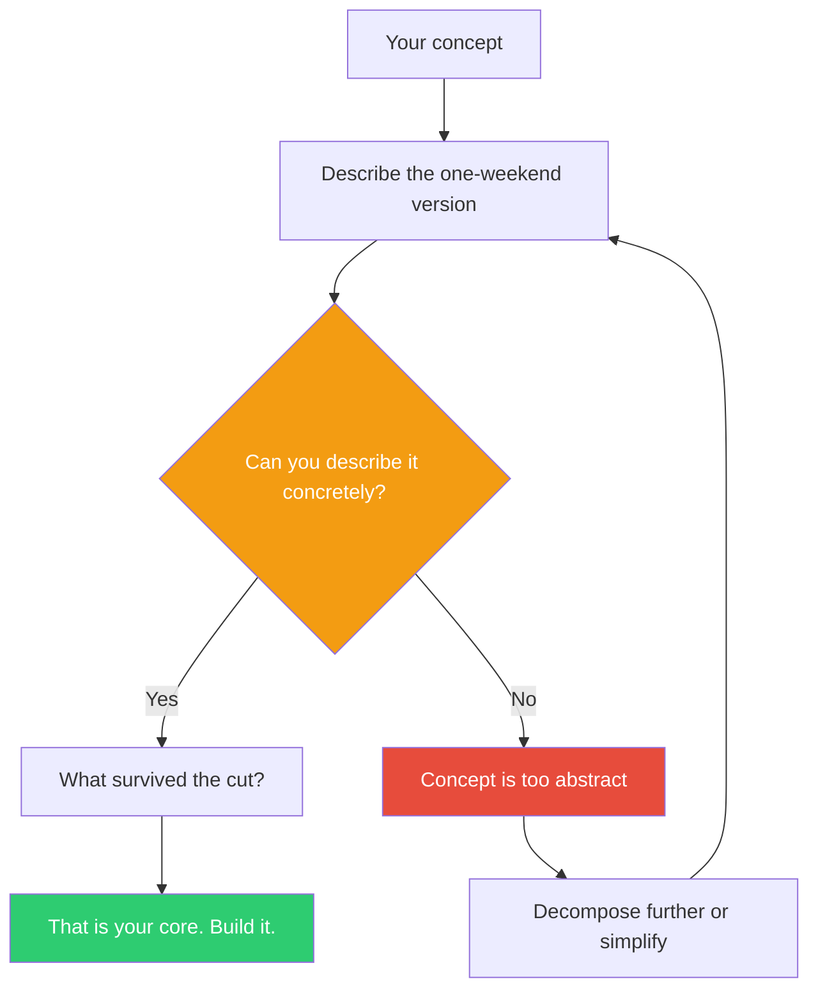

## The Move

You have a concept. Describe the version you could build in ONE WEEKEND. Not a plan for a weekend — the actual, embarrassingly minimal thing a person could use or experience by Sunday night. What's the cheapest, ugliest, most cut-down version that still lets someone experience the core idea?

If you can't describe a weekend version, your concept is too abstract — you need to keep decomposing until you can. If you can, you now know what the core actually is, because you had to choose what survives the cut.

## When to Use

- You have a concept you're excited about but no concrete starting point
- Scope keeps expanding and nothing is shipping
- You want to discover what the "core" of the idea really is by forcing yourself to choose
- You're stuck in planning loops and need to break toward action
- The gap between "vision" and "first version" feels impossibly large

## Diagram

## Example

**Concept:** "An AI-powered tool that helps engineering managers identify and resolve team dysfunction patterns."

**First attempt at weekend version:** "A dashboard that ingests Slack data, runs sentiment analysis, detects communication anti-patterns, and surfaces recommendations." That's not a weekend — that's a quarter.

**Actual weekend version:** A Google Form with 8 questions (adapted from known team health frameworks). A simple script that scores the responses and generates a one-page report: "Here's your team's top dysfunction, here's one thing to try this week." No AI, no Slack integration, no dashboard. The manager fills out the form based on their own observations. The report is a static HTML page.

**What survived the cut:** The core is "help a manager name the dysfunction and get one action." Everything else — the AI analysis, the Slack integration, the dashboard — is delivery mechanism, not core value. If the 8 questions and one-page report aren't useful, no amount of AI will save the product. If they are useful, you now know exactly what to automate next.

## Watch Out For

- "Weekend version" is a forcing function, not a literal deadline. The point is radical scoping, not crunch
- If your weekend version still sounds impressive, you haven't cut enough. It should feel embarrassing. A spreadsheet, a form, a single-page app with hardcoded data, a manual process you pretend is automated
- Don't confuse the weekend version with a demo or mockup. It should be something someone can actually *use*, even if crudely. The goal is to test the core value proposition, not to show a wireframe
- The thing you cut reveals what you think is essential. If you can't bear to cut the AI, ask yourself: is AI the core value, or is it just the part you find interesting to build?
