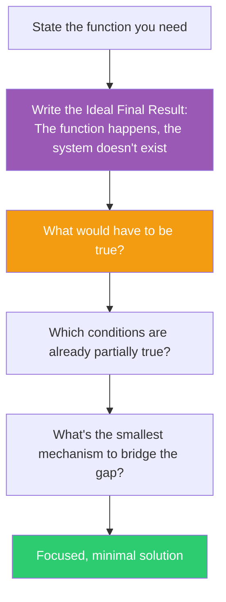

## The Move

Write one sentence describing the Ideal Final Result: the function you need is performed perfectly, but the system that performs it does not exist. There is no new mechanism, no added cost, no harmful side effects. The problem simply doesn't occur. This sounds absurd — that's the point. Now ask three questions: (1) What would have to be true for this ideal to actually work? (2) Which of those conditions are already partially true? (3) What is the smallest real mechanism that bridges the remaining gap? The gap between your current system and the ideal is your actual work list.

## When to Use

- At the start of design, before committing to any architecture
- When your solution has grown complex and you've lost sight of the goal
- When every proposed approach involves painful tradeoffs and you want a reference point
- When arguing about implementation details before establishing what "perfect" even means

## Diagram

## Example

**Problem:** "We need a permission system so users can only access their own data."

**Ideal Final Result:** Users can only access their own data, but there IS no permission system. No middleware checking roles. No access-control lists. No token validation layer. The data simply cannot be accessed by the wrong person.

**What would have to be true?**
1. Each user's data would have to be physically unreachable by other users
2. The data storage itself would enforce isolation
3. No shared namespace where cross-access is even possible

**Which conditions are partially true?** We already use separate database connections per tenant in our multi-tenant setup. Each tenant has a schema prefix.

**Smallest bridging mechanism:** Instead of building a permission layer on top of a shared database, use Row-Level Security (RLS) policies at the database level. The database itself enforces isolation — no application-level permission checks needed. The "permission system" is a single SQL policy per table, not a middleware stack.

**What we learned:** The ideal pointed directly at the database layer. The team had been designing an application-level RBAC system with roles, permissions, and middleware — all of which the ideal says shouldn't exist.

## Watch Out For

- The Ideal Final Result is a compass, not a specification. You will never fully reach it. The value is in the direction it sets
- Don't dismiss the ideal as "impossible" too quickly. The more impossible it feels, the more assumptions it's revealing
- Watch for the trap of stopping at the ideal and feeling clever. The real work is the three questions that follow
- Sometimes the ideal reveals that the problem itself is unnecessary — that's the best possible outcome
