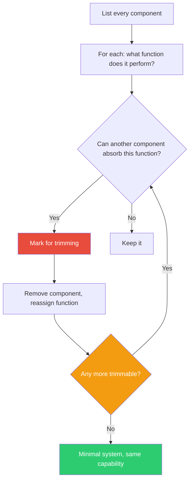

## The Move

Draw a table with three columns: Component, Function, and Can Another Component Do This? List every component in your system — every service, module, library, middleware, queue, and config file. For each one, write its primary function in plain language. Then ask: could an existing, remaining component absorb this function, either as-is or with a small modification? If the answer is yes, mark it for trimming. Remove the trimmed components and reassign their functions. Repeat until no more trimming is possible. The result is the simplest system that preserves all necessary functions.

## When to Use

- After a system has grown organically and you suspect redundancy
- Before a major refactor, to identify what can be merged or deleted
- When onboarding complexity is a problem — simpler systems are easier to learn
- When you want to reduce operational burden without losing capability

## Diagram

## Example

**Problem:** "Our data pipeline has eight services and is hard to maintain."

**Component table:**

| Component | Function | Can another absorb it? |
|---|---|---|
| Ingestion API | Receives data from sources | No — entry point |
| Validation Service | Checks data format | Yes — Ingestion API can validate on receipt |
| Deduplication Service | Removes duplicate records | Yes — the database can handle with UPSERT |
| Transformation Service | Maps fields to internal schema | No — core logic |
| Enrichment Service | Adds metadata from external APIs | Yes — Transformation Service can call enrichment as a step |
| Message Queue | Buffers between services | Partially — fewer services means less need for buffering |
| Storage Writer | Writes to the database | Yes — Transformation Service can write directly |
| Monitoring Sidecar | Tracks pipeline health | No — cross-cutting concern |

**After trimming:** Eight services become four. Ingestion API absorbs validation. Transformation Service absorbs enrichment and writes directly to storage. The database handles deduplication via UPSERT. The message queue is simplified to buffer only between ingestion and transformation.

**What we learned:** Five of the eight services existed because someone decided each "step" needed its own service. Trimming revealed that only two services had genuinely distinct responsibilities.

## Watch Out For

- Trimming is not the same as cramming. If absorbing a function makes the host component unreasonably complex, that's a sign the function needs its own home
- Trim functions, not capabilities. The system should do everything it did before, just with fewer parts
- Check for hidden coupling — sometimes a component exists to provide isolation between two others, and removing it creates a dependency you didn't want
- Do this on paper first. Don't start deleting services in production as a discovery exercise
