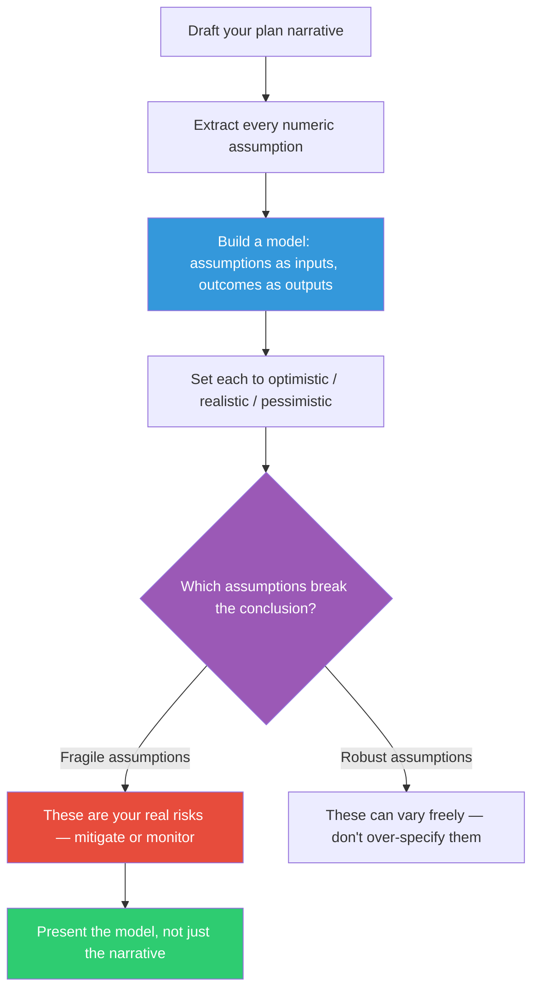

## The Move

Take the plan, proposal, or estimate you're about to write. Identify every assumption that contains a number or a choice: headcount, timeline, churn rate, adoption rate, cost per unit, infrastructure capacity, error rate. Instead of writing "we'll need 3 engineers for 4 months," write it as a formula: `engineers * months_per_engineer * cost_per_month`. Put the assumptions in a spreadsheet, a notebook, or any tool where changing an input instantly updates the output. Now adjust each assumption to its optimistic, realistic, and pessimistic values. Which assumptions does the conclusion survive? Which ones break it? The assumptions that break the conclusion are your actual risks — not the ones you labeled as risks in the narrative.

## When to Use

- You're writing a project proposal with timeline and cost estimates
- A business case depends on adoption rates, conversion rates, or growth projections
- Stakeholders need to understand the range of possible outcomes, not just one scenario
- You suspect the plan is only viable under optimistic assumptions but can't prove it

## Diagram

## Example

**Situation:** A startup CTO is writing a proposal to migrate from a monolith to microservices. The plan says: "With 4 engineers over 6 months, we can decompose the monolith into 8 services, reducing deploy time from 45 minutes to 5 minutes and enabling independent scaling."

**Making it reactive:** She builds a spreadsheet with these inputs:

| Assumption | Optimistic | Realistic | Pessimistic |
|------------|-----------|-----------|-------------|
| Engineers available | 4 | 3 (one leaves) | 2 |
| Months to complete | 4 | 6 | 10 |
| Services to extract | 5 | 8 | 12 |
| Hidden coupling discoveries per service | 1 | 3 | 7 |
| Weeks lost per coupling discovery | 0.5 | 1 | 2 |

The output formula: `total_weeks = services * (base_weeks_per_service + coupling_discoveries * weeks_per_discovery)` / `engineers`

**What the model revealed:** Under realistic assumptions, the project takes 6 months. But the pessimistic scenario — which only requires two assumptions to go wrong (coupling discoveries = 7, weeks per discovery = 2) — takes 18 months with 2 engineers. The CTO realized the plan was brittle against the coupling discovery rate, which was the hardest thing to estimate upfront. She restructured the plan: extract 3 low-risk services first (2 months), measure the actual coupling discovery rate, then re-plan the rest with real data. The reactive document turned a fragile 6-month bet into an adaptive 2-month probe.

## Watch Out For

- The model doesn't need to be precise — it needs to be directionally correct. A spreadsheet with 5 inputs and 2 outputs beats a narrative with zero adjustable parameters
- Beware of false precision. If your model says "7.3 months," the right answer is "6-10 months depending on X and Y." The range is the point
- Stakeholders often fixate on the specific numbers you put in the model rather than the structure. Frame it as "here's a tool for exploring scenarios" not "here's the answer"
- If a model has more than 10-15 inputs, it's too complex to reason about. Collapse correlated assumptions into a single "scenario" variable (best case, base case, worst case)
