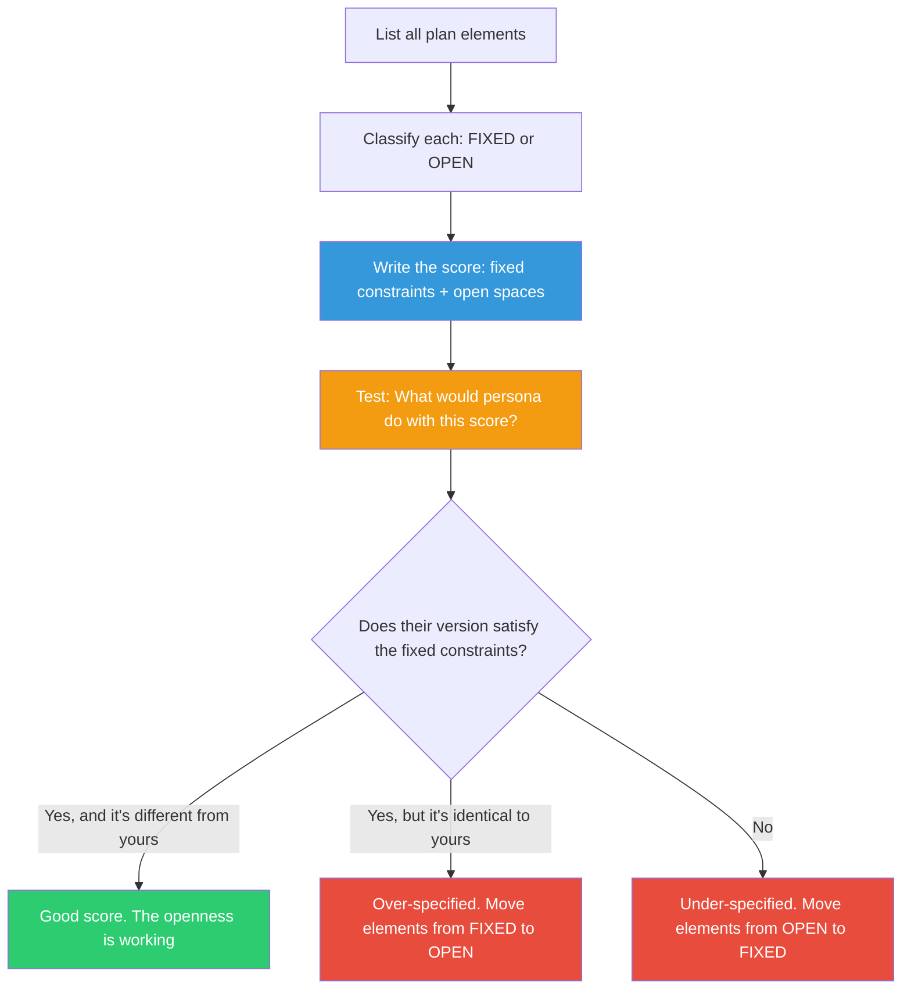

## The Move

Write your plan as a Cage-style "score" — a set of instructions where some elements are fixed and others are deliberately left open. Divide every element of your plan into two columns: FIXED (must be exactly this — the non-negotiable constraints, the invariants, the interface contracts) and OPEN (the performer decides — implementation details, ordering, internal structure, tooling choices). Now test the score: imagine **{{persona.1}}** is "performing" your plan. What would their version look like? Would it satisfy the fixed constraints? Would their open choices produce something viable? If radically different performers would all produce good results, your score is well-designed. If only one specific implementation satisfies your constraints, you've over-specified and should move things from FIXED to OPEN.

## When to Use

- You're writing a technical spec that multiple teams or people will implement
- You need to define an API contract, an architecture boundary, or a platform interface
- You're delegating work and want to give the right amount of structure without micromanaging
- You're designing a system that needs to accommodate future implementations you can't predict

## Diagram

## Example

**Situation:** A platform architect needs to define how all backend services handle authentication. She could write a detailed spec dictating the exact middleware, token format, and validation logic — or she could write an indeterminacy score.

**The score:**

| Element | Classification | Specification |
|---------|---------------|---------------|
| Auth token format | FIXED | JWT with RS256, must contain `sub`, `exp`, `roles` claims |
| Token validation endpoint | FIXED | `POST /auth/validate` returns 200 with decoded claims or 401 |
| Where validation happens | OPEN | Middleware, API gateway, sidecar — performer's choice |
| Token caching | OPEN | Cache or don't, any strategy, any TTL |
| Language/framework | OPEN | Any language, any HTTP framework |
| Error response format | FIXED | `{"error": "unauthorized", "code": 401}` — exact shape |
| Logging auth failures | FIXED | Must emit structured log with `event=auth_failure` |
| Rate limiting auth attempts | OPEN | Any strategy or none |

**Persona test:** Imagine {{persona.1}} performing this score. A junior developer might validate in middleware with no caching — simple and correct. A performance-focused senior might use an API gateway with aggressive caching and rate limiting — optimized and correct. A team using Go would implement differently from a team using Python — both correct. The score is well-designed because all three performers satisfy the fixed constraints while making different open choices.

**What this revealed:** The architect's first draft had "must use middleware validation" as FIXED. The persona test showed this was an implementation preference, not a requirement. Moving it to OPEN allowed the Go team to use their preferred sidecar pattern, which turned out to perform better.

## Watch Out For

- The hardest part is classifying correctly. If you mark everything FIXED, you've written a traditional spec (no room for creativity or context-specific optimization). If you mark everything OPEN, you've written a wish, not a plan
- Test with at least two very different personas. If a beginner and an expert would both succeed with your score, the fixed/open balance is right
- Interface boundaries are almost always FIXED. Internal implementation is almost always OPEN. When in doubt, fix the what and open the how
- Indeterminate doesn't mean unaccountable. The performer still has to satisfy the fixed constraints. The score defines what "correct" means while leaving room for "correct and different"
