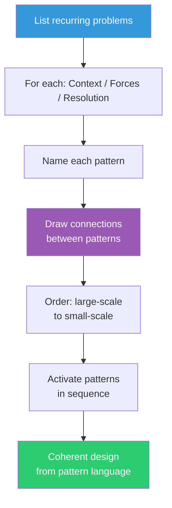

## The Move

List the recurring design problems in your domain — not solutions, PROBLEMS. For each one, write three things: (1) CONTEXT — when and where does this problem arise? (2) FORCES — what tensions are in play? What makes this hard? What competing needs must be balanced? (3) RESOLUTION — how do you resolve the tension so the forces reach equilibrium? Give each pattern a name. Now draw the connections: which patterns contain other patterns? Which are peers? Which must be activated before others? The resulting network is your pattern language. Use it to design by activating patterns in sequence — large-scale patterns first, then progressively smaller ones — rather than by making ad-hoc decisions.

## When to Use

- Designing a new system or subsystem from scratch
- Onboarding a team that needs a shared vocabulary for design decisions
- Noticing that the same design debates keep recurring across projects
- You want to capture institutional knowledge in a form more useful than documentation
- The architecture has grown incoherent and needs a unifying framework

## Diagram

## Example

**Situation:** A team is designing an internal developer platform. Instead of starting with a tech stack, they build a pattern language.

**Patterns identified:**

1. **Golden Path** (large-scale) — *Context:* Developers need to build services. *Forces:* Freedom vs. consistency. Too many choices slow developers down; too few feel restrictive. *Resolution:* Provide one well-supported, opinionated path (the "golden path") that covers 80% of use cases, with escape hatches for the rest.

2. **Self-Service Provisioning** (medium-scale) — *Context:* Teams need infrastructure. *Forces:* Speed vs. governance. Waiting for ops is slow; ungoverned provisioning creates sprawl. *Resolution:* Offer a catalog of pre-approved templates that teams can deploy without approval. Anything outside the catalog requires a lightweight review.

3. **Observable by Default** (medium-scale) — *Context:* Services run in production. *Forces:* Debugging needs vs. instrumentation cost. Developers won't add observability unless it's easy. *Resolution:* Bake tracing, metrics, and structured logging into the golden path templates so every service is observable from day one.

4. **Docs as Code** (small-scale) — *Context:* Platform features need documentation. *Forces:* Docs go stale when separated from code. *Resolution:* Generate docs from the same source as the templates. Changes to the platform automatically update the docs.

**Connections:** Golden Path CONTAINS Self-Service Provisioning and Observable by Default. Observable by Default REQUIRES Docs as Code (because observability tooling needs documentation to be usable). The team activates patterns in order: Golden Path first (define the opinionated path), then Self-Service Provisioning (make it deployable), then Observable by Default (bake in observability), then Docs as Code (ensure it's all documented).

## Watch Out For

- Patterns are not the same as design patterns (GoF). Alexander's patterns describe PROBLEMS and TENSIONS, not just solutions. If your pattern doesn't name the forces, it's just a template
- Don't try to build a complete pattern language upfront. Start with 5-7 patterns. The language will grow as you encounter new tensions
- The connections between patterns matter as much as the patterns themselves. An unconnected pattern is useful; a connected language is generative
- Resist the urge to make patterns too abstract. "Separation of Concerns" is a principle, not a pattern. A pattern has a specific context and specific forces. The more concrete, the more useful
