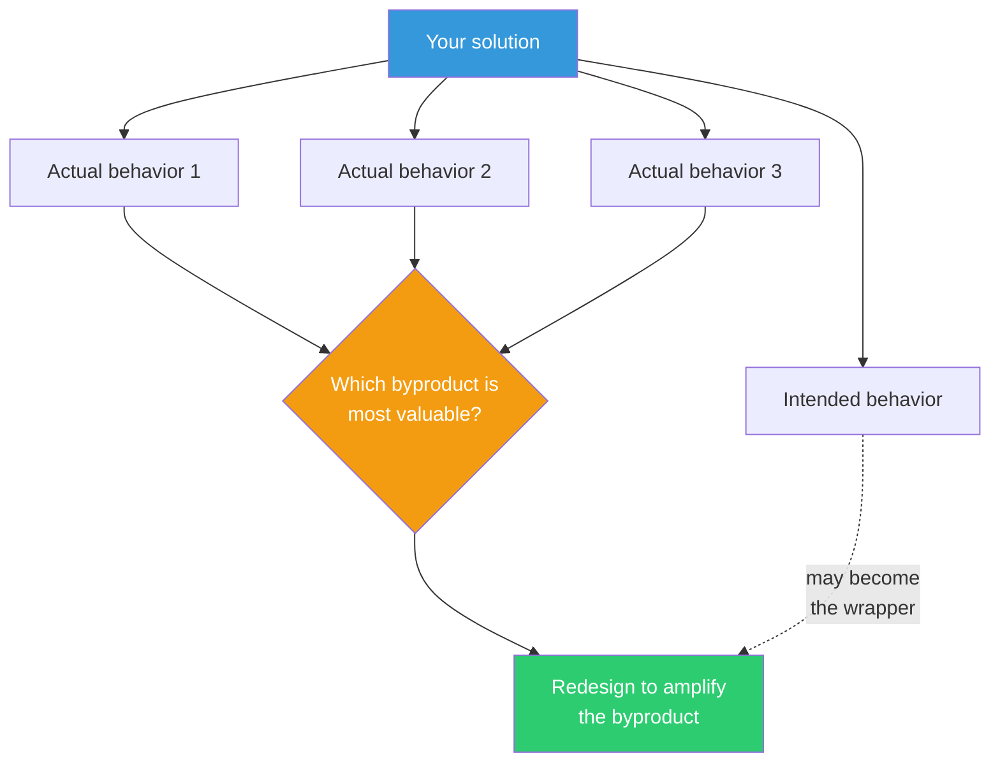

## The Move

What byproduct would {{persona.1}} value more than the main product? List the three to five actual behaviors your solution produces in users — not what you intend, but what people actually do. For each behavior, ask: "If THIS were the product, how would I design for it?" Pick the most valuable byproduct and redesign your solution to amplify it. The intended feature becomes the wrapper; the byproduct becomes the core.

This works because the gap between intended and actual use is where product-market fit hides. What people do when they think nobody is watching is more honest than what they say they want.

## When to Use

- Users are using your product in ways you did not design for
- You notice an accidental side effect that's generating surprising value
- You're building a feature and want to anticipate what it will actually produce
- The stated value proposition feels weaker than some secondary benefit

## Diagram

## Example

**Situation:** You build an internal CLI tool that generates boilerplate code from templates. The intended product is the generated code.

**Actual behaviors observed:**
1. Engineers use it to generate boilerplate (intended)
2. Engineers read the templates to understand architectural patterns (unintended)
3. New hires use the tool as an onboarding guide — they run it to see what a "correct" service looks like (unintended)
4. Teams copy and modify templates as a way to propose new patterns (unintended)

**Most valuable byproduct:** #3 — the tool is secretly an onboarding accelerator.

**Redesign:** Add a `--explain` flag that annotates the generated code with why each decision was made. Add a `--tour` mode that walks through the architecture step by step. The code generator is now the wrapper; the onboarding tool is the product.

## Watch Out For

- Not every byproduct is desirable — some are bugs you should fix, not features you should amplify. Apply judgment
- This move requires real observation of actual usage. If you're speculating about byproducts without data, you're just guessing
- Beware of abandoning the original purpose entirely. Sometimes the byproduct supplements the core; it doesn't always replace it
- If users are misusing your tool in harmful ways, that's a different problem — don't design around abuse
