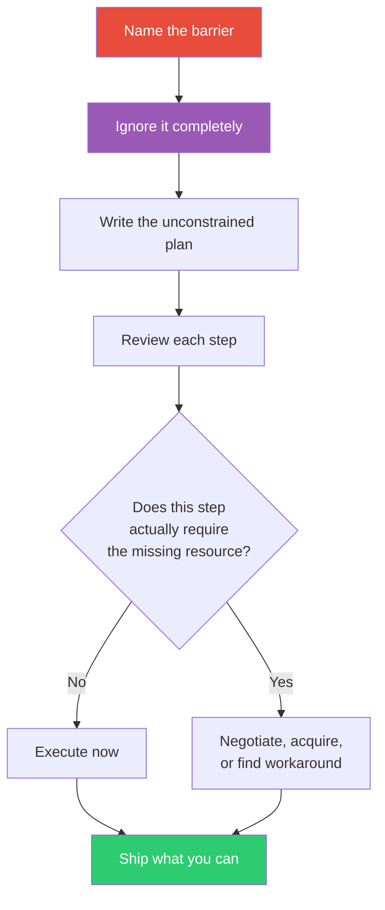

## The Move

Name the barrier that is stopping you: lack of expertise, budget, authority, team size, time, or something else. Now ignore it entirely. Assume you have whatever you lack. Write the plan you would execute if that barrier did not exist. Do not hedge, qualify, or scale down. Once the plan is written, examine it: which parts actually require the missing resource, and which parts were self-censored? You will often find that 60-80% of the "as if" plan is executable right now. The barrier was psychological, not structural. Ship the parts you can; negotiate for the parts you cannot. Also try: **what if {{constraint.1}} were removed?**

## When to Use

- You are self-censoring because you feel unqualified
- A constraint feels absolute but you have never tested it
- The team is in "learned helplessness" mode, assuming nothing can change
- You need to generate an ambitious plan before negotiating it down to reality

## Diagram

## Example

**Barrier:** "We can't redesign the auth system — none of us are security experts."

**Act-as-if plan (pretend you are security experts):**
1. Audit the current auth flow and document every token lifecycle
2. Identify the three weakest points using OWASP top 10 as a checklist
3. Replace the hand-rolled session management with an industry-standard library
4. Add rate limiting and anomaly detection on the login endpoint
5. Commission a professional pen test on the result

**Reality check:**
- Steps 1-2: Require no expertise beyond reading docs. Executable now.
- Step 3: Replacing custom code with a well-maintained library *reduces* the need for expertise. Executable now.
- Step 4: Standard engineering work. Executable now.
- Step 5: This is the only step that requires outside expertise — and it's the verification step, not the implementation.

**Result:** 4 out of 5 steps are executable immediately. The "we're not security experts" barrier was blocking work that doesn't require security expertise. The one step that does require expertise (pen test) can be outsourced for a fraction of the cost of the full redesign.

## Watch Out For

- This move liberates, but don't let it make you reckless. In genuinely safety-critical domains (medical, financial, infrastructure), the barrier may be real and the consequence of ignoring it severe
- "Act as if" is for planning, not for misrepresenting your qualifications. You are making a plan, not committing fraud
- If the entire plan requires the missing resource, the barrier is real. Acknowledge it and seek the resource rather than pretending
- The psychological insight cuts both ways: sometimes you're not self-censoring, you're correctly recognizing a genuine limitation. Use judgment
