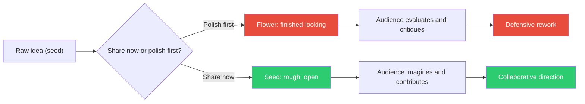

## The Move

You have an idea, a design, or a plan. Your instinct is to polish it before showing anyone. Override that instinct. Take the idea in its current, rough form — sketch, bullet points, half-built prototype, napkin diagram — and show it to the relevant person NOW. Frame it explicitly: "This is a seed, not a proposal. I'm showing it early so you can shape it with me." When people see a seed, they imagine what it could become and contribute their vision. When people see a polished flower, they judge what it IS and look for flaws. The same person gives different feedback at different stages. Get the generative feedback, not the evaluative feedback.

## When to Use

- You have been working on something for more than a day without showing anyone
- Past feedback has come too late and required expensive rework
- Stakeholders feel surprised by final outputs and push back defensively
- You are waiting to feel "ready" to share and that moment keeps receding

## Diagram

## Example

**Situation:** You are designing a new permissions model for a multi-tenant SaaS app. You have spent two days on a detailed RFC with role hierarchies, permission matrices, and migration plans. You are about to spend another day adding edge case analysis before sharing with the team.

**Present the seed instead:** Share a 5-bullet Slack message: "Thinking about permissions. Rough direction: (1) roles are per-workspace not global, (2) three built-in roles: viewer/editor/admin, (3) custom roles as a paid feature, (4) permissions are additive only (no deny rules), (5) migration: map existing users by current usage patterns. Poking holes welcome."

**What happens:** The tech lead replies: "Additive-only is clever but breaks for the compliance customers — they need explicit deny on PII fields." The product manager replies: "Love per-workspace roles. Can we demo this to the enterprise prospect on Thursday?" The junior engineer asks: "What about API keys — do they get roles too?"

**Result:** In 10 minutes you got: a critical design constraint (deny rules for compliance), a business opportunity (Thursday demo), and a scope question you missed (API key permissions). If you had shared the polished RFC, you would have gotten: "Looks good, some minor comments on the migration section." The seed got generative feedback. The flower would have gotten copyediting.

## Watch Out For

- Frame the share explicitly as a seed. If you show rough work without context, people assume it is your best effort and judge accordingly. The framing is load-bearing
- Not everything should be a seed. If the audience needs to make a go/no-go decision, give them a flower. Seeds are for shaping, not for approval
- Some people are bad at seed-stage feedback. They will say "I need to see more before I can comment." Show them a slightly more developed seed next time — but do not wait for the flower
- Vulnerability is the mechanism. Showing unfinished work feels risky. That risk is what creates the collaborative space. If it felt safe, everyone would already do it
