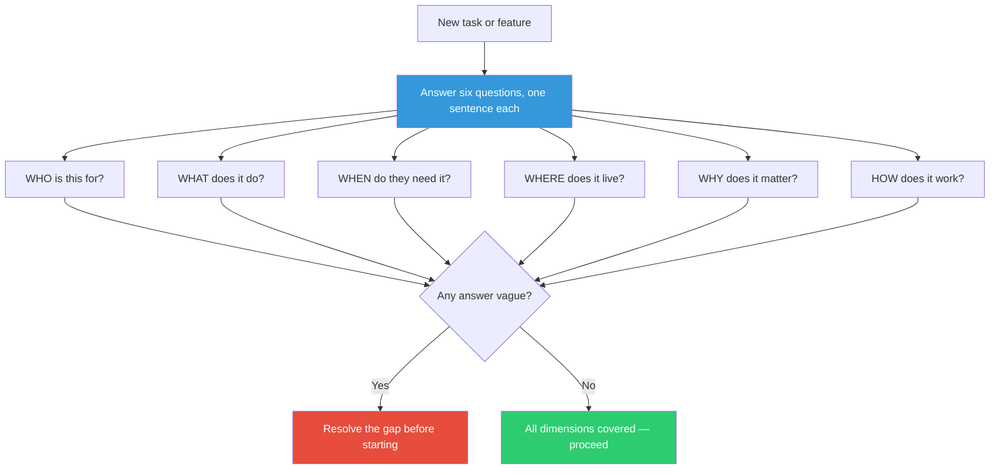

## The Move

Before starting work, answer these six questions in one sentence each. Write the answers down — do not just think them. (1) WHO is this for? Name a specific user or persona. (2) WHAT does it do? One sentence, no jargon. (3) WHEN do they need it? A date or a trigger condition. (4) WHERE does it live? Which system, repo, service, or context. (5) WHY does it matter? What changes if this ships vs. does not ship. (6) HOW does it work? The one-sentence mechanism.

If any answer is vague ("everyone," "whenever," "because it's better," "somewhere in the backend"), you have found a gap. Resolve the gap before writing code. The framework works because it is both simple and complete — it forces you to address the dimensions that planning typically skips.

## When to Use

- At the start of any task, feature, or project
- When a ticket or brief feels complete but you sense gaps
- When team members disagree about scope — often they agree on WHAT but disagree on WHO or WHY
- As a quick sanity check before a sprint commitment

## Diagram

## Example

**Task:** "Add rate limiting to the API."

**WHO:** Power users hitting the search endpoint more than 100 times per minute, and the downstream payment service that gets overwhelmed.

**WHAT:** Per-user request throttling that returns HTTP 429 with a Retry-After header when the limit is exceeded.

**WHEN:** Before the Black Friday traffic spike on November 15th. Non-negotiable deadline because last year the payment service went down.

**WHERE:** The API gateway layer (Kong), not individual services. Centralized so all endpoints are covered.

**WHY:** Last Black Friday, three power users caused a cascading failure in the payment service, resulting in 45 minutes of downtime and approximately $120K in lost revenue.

**HOW:** Token bucket algorithm in Kong, backed by a shared Redis counter per API key, with configurable limits per endpoint tier.

**Gap found:** The original ticket said "add rate limiting" — it did not specify per-user vs. global, which layer, or why it was urgent. The Five Ws turned a vague ticket into an actionable specification in five minutes.

## Watch Out For

- One sentence each. If your WHO answer is a paragraph, you are overcomplicating — pick the primary user
- "Everyone" is not a WHO. "Whenever" is not a WHEN. "Because it's important" is not a WHY. These are the vague answers that signal gaps
- The HOW answer at this stage should be a mechanism, not an implementation plan. "Token bucket in Redis" not "Step 1: create a Lua script..."
- This move is diagnostic, not exhaustive. It finds gaps in understanding. Filling those gaps may require research, conversations, or other ThinkFu moves
