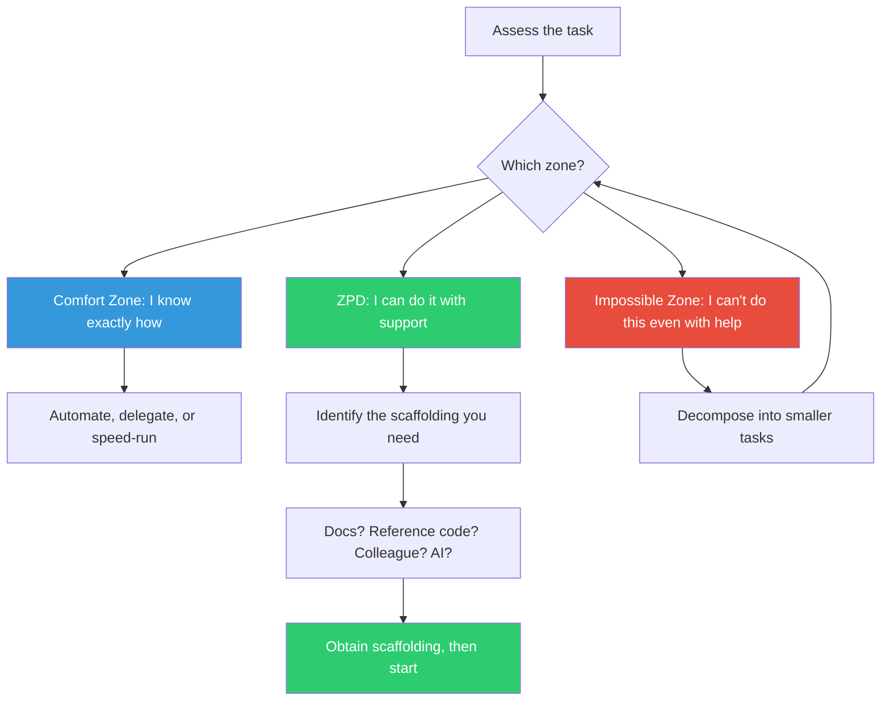

## The Move

Before starting a task, classify it into one of three zones. (1) COMFORT ZONE — you have done this before, you know exactly how, and there is no uncertainty. This is execution, not learning. (2) IMPOSSIBLE ZONE — you cannot do this even with help, tools, or references. The gap is too large. (3) ZONE OF PROXIMAL DEVELOPMENT — you cannot do this alone from memory, but you can do it with the right support: documentation, a reference implementation, a more experienced colleague, or an AI assistant.

If the task is in the comfort zone, ask whether it should be automated or delegated. If it is in the impossible zone, decompose it into smaller tasks until each sub-task lands in the ZPD. If it is already in the ZPD, identify the specific scaffolding you need and obtain it before starting.

## When to Use

- At the start of a task, to calibrate your approach and estimate accurately
- When you are consistently failing at a task — it may be in the impossible zone and needs decomposition
- When work feels mindless — you may be in the comfort zone and wasting your capacity
- When estimating effort — ZPD tasks take longer than comfort-zone tasks but produce better outcomes

## Diagram

## Example

**Task:** "Implement end-to-end encryption for the chat feature using the Signal Protocol."

**Zone assessment:**
- Do I know how to build a chat feature? YES — comfort zone.
- Do I know how to implement the Signal Protocol from scratch? NO, and even with documentation, the cryptographic primitives are beyond my expertise — impossible zone.
- Do I know how to integrate an existing Signal Protocol library (like libsignal) into our chat feature? NOT from memory, but with the library docs and example code — ZPD.

**Decomposition:**
The original task ("implement E2E encryption using Signal Protocol") was in the impossible zone. But breaking it apart reveals:
1. "Integrate libsignal into our Node.js backend" — ZPD (need: library docs + example project)
2. "Implement key exchange during user registration" — ZPD (need: Signal Protocol spec for key bundles)
3. "Encrypt/decrypt messages in the chat service" — ZPD (need: libsignal API reference)
4. "Design the cryptographic primitives" — remains impossible, but we are no longer doing this; the library handles it

**Scaffolding obtained:** libsignal documentation, the Signal Protocol specification, and an open-source reference implementation in a similar stack.

Each sub-task is now in the ZPD — achievable with the identified support, and each one builds capability for the next.

## Watch Out For

- Be honest about which zone you are in. Ego pushes tasks toward the comfort zone ("I can figure this out"). Imposter syndrome pushes them toward the impossible zone ("I'll never be able to do this"). Neither is helpful
- The ZPD shifts as you learn. A task that starts in the ZPD moves to the comfort zone after you complete it once. Re-assess periodically
- Scaffolding is not cheating. Using documentation, AI assistance, or reference code to accomplish a ZPD task is exactly how learning works. Struggling without support in the impossible zone is not virtue — it is waste
- Some tasks genuinely belong in the comfort zone and that is fine. Not everything needs to be a growth experience. But if ALL your tasks are comfort-zone tasks, you are stagnating
