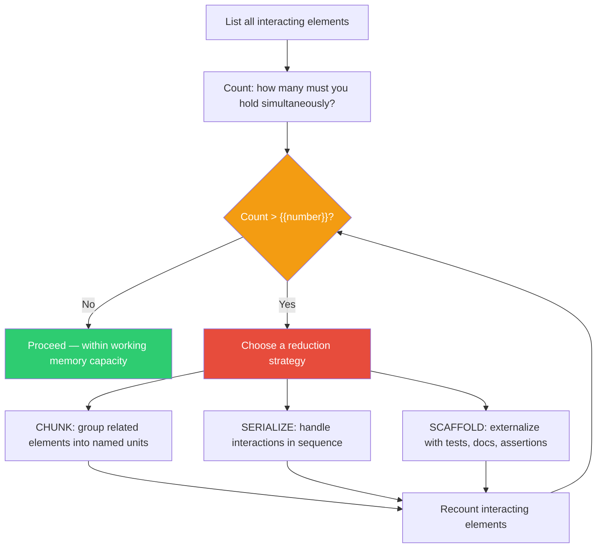

## The Move

List every element in your current problem that INTERACTS with another element — not total elements, but elements you must consider simultaneously because changing one affects another. Count them. If the count exceeds **{{number}}** (roughly your working memory capacity for interacting items), you cannot process them in parallel. You must reduce the simultaneous set using one of three strategies. CHUNK: group tightly-coupled elements into a single named unit (e.g., "the auth subsystem" instead of token + session + refresh + permissions). SERIALIZE: handle interactions in sequence instead of all at once (e.g., "first get A-B right, then introduce C"). SCAFFOLD: externalize some elements so you can offload them from working memory (e.g., write invariants as assertions so you do not have to remember them). Which strategy gets you below {{number}} interacting elements?

## When to Use

- You keep dropping a detail while juggling multiple interacting concerns
- A change in one part of the system keeps causing unexpected breakage in another
- You are trying to design or debug something with many moving parts
- The problem does not decompose cleanly into independent sub-problems

## Diagram

## Example

**Situation:** You are designing a feature where users can schedule recurring reports that filter data by role-based permissions, format output in multiple templates, and deliver via email, Slack, or webhook.

**Element inventory (interacting elements):**
1. Schedule recurrence logic (cron patterns, timezone handling)
2. Role-based permission filters (which data each role can see)
3. Report template formatting (PDF, CSV, HTML)
4. Delivery channel routing (email, Slack, webhook — each with different payload requirements)
5. User preferences (preferred format, preferred channel, timezone)
6. Data freshness (reports should reflect data as of the scheduled time, not generation time)
7. Error handling (what happens when a delivery channel fails? retry? fallback?)
8. Audit logging (who received what, when)

**Count: 8 interacting elements.** That exceeds {{number}}. You cannot design this all at once.

**Reduction:**
- **CHUNK:** Group (1, 5, 6) into "Scheduling Subsystem" — these are tightly coupled around time. Group (3, 4) into "Output Pipeline" — format and delivery are sequential.
- **SERIALIZE:** Design the Scheduling Subsystem first, assuming a single format and single channel. Then layer in the Output Pipeline. Then add error handling and audit logging last.

**Recount:** Scheduling Subsystem (1 chunk) + Permission Filters (1) + Output Pipeline (1 chunk) + Error Handling (1) + Audit Logging (1) = 5 interacting elements. That is at or below {{number}}. Now you can reason about the design.

## Watch Out For

- Do not confuse total element count with interacting element count. Ten independent items are easy; five deeply intertwined items are hard. It is the interactions that consume working memory
- Chunking only works if the elements within a chunk truly interact more with each other than with elements outside the chunk. Bad chunking creates hidden cross-chunk dependencies
- Serialization introduces a risk: the early decisions may constrain the late ones. Re-check your early choices after the full picture is assembled
- The number {{number}} is a heuristic, not a law. Your actual capacity depends on domain expertise — experts chunk automatically, effectively increasing their working memory for familiar patterns
