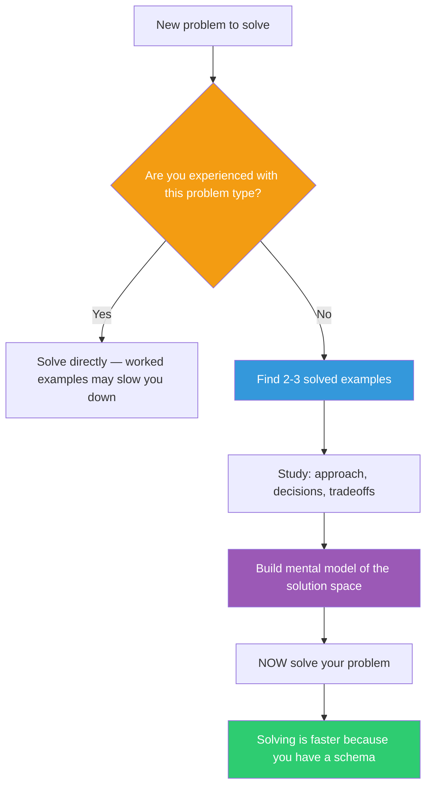

## The Move

Before you start solving, stop. Find 2-3 solved examples of problems similar to yours. Read them carefully — not to copy, but to STUDY. For each example, answer: "What was their approach? What decisions did they make and why? What would I have done differently?" Sweller's research showed that when you are not yet expert in a domain, the problem-solving process itself creates extraneous cognitive load: your brain is simultaneously searching for the goal, managing sub-goals, and tracking state — a means-ends analysis that crowds out actual understanding. Studying solved examples lets you build a mental model without the overhead of search. Study first. Solve second. You will be faster at both.

## When to Use

- You are about to attempt something outside your area of expertise
- You are tempted to "just start coding" on an unfamiliar problem type
- You have tried to solve the problem and floundered in the first 15 minutes
- You are a beginner or intermediate in the relevant domain

## Diagram

## Example

**Situation:** You need to implement rate limiting for your API. You have a general idea — "track request counts per user, block when they exceed a threshold" — but you have never built one.

**Instead of jumping into code:**
1. **Example 1:** Read the Stripe engineering blog post on rate limiting. Note: they use a token bucket algorithm, not a simple counter. They chose token bucket because it handles burst traffic gracefully.
2. **Example 2:** Read the Redis-based rate limiter in an open-source API gateway. Note: they use a sliding window, not a fixed window, to avoid the "boundary burst" problem where a user sends max requests at 11:59 and again at 12:01.
3. **Example 3:** Read a Go implementation of a leaky bucket. Note: they separate the rate limiter from the enforcement policy — the limiter says "yes/no" and the middleware decides what to do with "no" (429 response vs queue vs degrade).

**What you learned before writing a line of code:**
- There are at least three algorithms (token bucket, sliding window, leaky bucket) — you did not know this
- The "boundary burst" problem is a real pitfall you would have hit
- Separating limiter logic from enforcement policy is a design decision you would have skipped

**Result:** You choose sliding window log with Redis, enforce at the middleware layer with configurable responses per route. Implementation takes 2 hours instead of the 6 it would have taken through trial and error. You also avoided the boundary burst bug.

## Watch Out For

- This move has a reversal point: for experts, studying worked examples is LESS effective than solving directly (the "expertise reversal effect"). If you already know the domain well, skip straight to solving
- Studying is not copying. If you cargo-cult a solution without understanding the decisions behind it, you have the worst of both worlds — borrowed code you cannot debug
- Do not use "I should study more examples" as procrastination. Two to three examples are enough. You are building a mental model, not conducting a literature review
- Choose examples that are at your level of complexity. A hyper-optimized production system may be the wrong example if you need to understand the basics first
