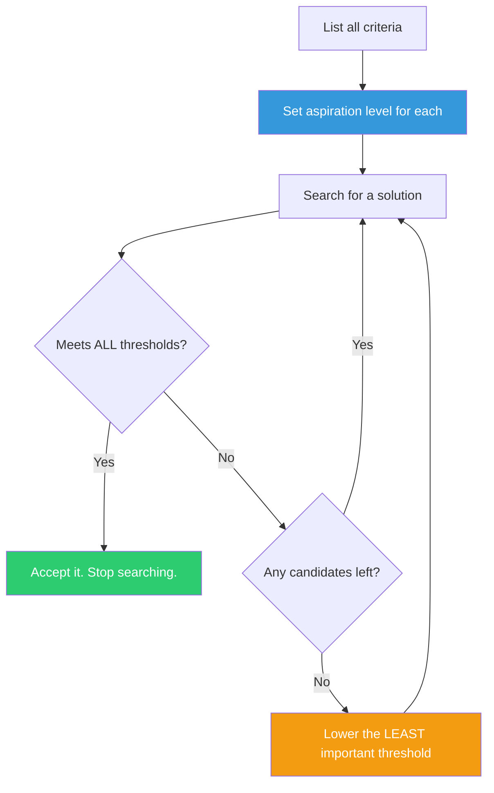

## The Move

Before you search for solutions, write down every criterion that matters: speed, cost, quality, maintainability, time-to-ship, whatever applies. For EACH criterion, set an explicit aspiration level — the threshold below which you will not accept a solution and above which you will stop optimizing. Search until you find something that meets ALL thresholds. If nothing qualifies, lower the aspiration on the LEAST important criterion by one notch and search again. Stop the moment a candidate clears every bar.

## When to Use

- You've been comparing options for more than a day without converging
- The team argues in circles because everyone has a different implicit standard
- You catch yourself rejecting workable solutions because they aren't ideal on one dimension
- You need to decide quickly but don't want to settle blindly

## Diagram

## Example

**Situation:** You're choosing an authentication library for a new microservice. The team has spent three days reading comparison blog posts.

**Set aspiration levels:**
- **Security:** Must support OAuth 2.0 + PKCE. Non-negotiable.
- **Maintenance:** Must have a release in the last 6 months. Non-negotiable.
- **Integration effort:** Less than 2 days to integrate. Flexible.
- **Performance:** Token validation under 5ms p99. Flexible.

**Search:** Library A meets security and maintenance but integration estimate is 3 days. Library B meets all four. Accept Library B. Stop evaluating Libraries C through G.

**Without aspiration levels:** The team would have spent another two days benchmarking Library F's 2ms advantage on token validation — an optimization nobody asked for on a criterion already above threshold.

## Watch Out For

- Setting aspirations too high on every criterion recreates the perfectionism problem. At least one criterion should have a genuinely relaxed threshold
- Aspiration levels should be written down and shared with the team BEFORE the search begins. Setting them after seeing options invites anchoring bias — you'll unconsciously set thresholds to match the option you already prefer
- Simon's point is that satisficing is RATIONAL given bounded cognition and time. It's not laziness. Optimizing is only better when the cost of continued search is lower than the expected gain — and for most software decisions, it isn't
- Revisit aspirations if the problem changes. A threshold set on Monday may be wrong by Friday if requirements shifted
