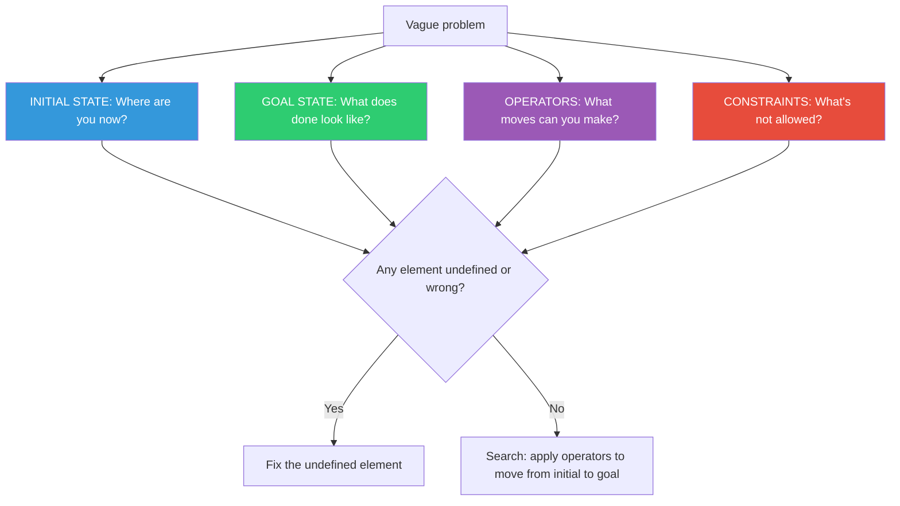

## The Move

Write four headings on a page. Under **INITIAL STATE**, describe exactly where you are right now — not where you wish you were, not where you were last week. Under **GOAL STATE**, describe the specific, observable condition that means you're done. Under **OPERATORS**, list every action you can take that changes the state — tools, refactors, conversations, deployments, anything. Under **CONSTRAINTS**, list what's forbidden or fixed — deadlines, backward compatibility, team size, budget. If you're stuck, one of these four is undefined or wrong. Find it.

## When to Use

- A problem feels overwhelming and you don't know where to start
- You're making moves but can't tell whether you're progressing
- Multiple people describe the same problem differently
- You suspect the problem is actually simpler than it feels but can't see why

## Diagram

## Example

**Situation:** Your team is tasked with "improving the onboarding experience." Everyone has ideas but nothing converges.

**INITIAL STATE:** New users complete signup, land on an empty dashboard, and 68% drop off within 24 hours without creating their first project.

**GOAL STATE:** 50% of new users create their first project within 1 hour of signup.

**OPERATORS:** Add an onboarding wizard. Pre-populate a sample project. Send a follow-up email sequence. Add tooltips. Simplify the "create project" flow. Add a video walkthrough. Assign a human onboarding rep.

**CONSTRAINTS:** No new hires (team of 4). Must ship within 6 weeks. Cannot change the core data model. Must work for both free and paid tiers.

**Discovery:** The goal state was undefined — "improve onboarding" has no finish line. Once you wrote "50% create first project within 1 hour," the team immediately agreed that pre-populating a sample project plus simplifying the create flow was the highest-leverage combination. The formless problem became a tractable search.

## Watch Out For

- The most common missing element is a precise goal state. "Make it better" is not a goal state. It must be observable and testable
- Listing operators is not the same as choosing one. Map them all first, then evaluate
- Constraints you think are fixed may be negotiable. Flag any constraint you haven't verified with the person who imposed it
- If operators and constraints are both extensive, you likely need to decompose the problem first (TF-164) — the space is too large to search as one unit
