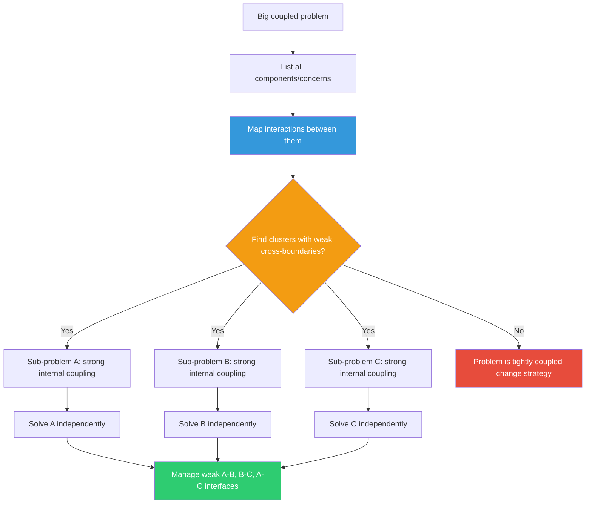

## The Move

List all the components, concerns, or variables involved in your problem. Draw the interaction map: which components talk to, depend on, or affect which others? Look for clusters — groups where internal interactions are frequent and strong, but cross-group interactions are infrequent and weak. Those clusters are your sub-problems. Solve each sub-problem independently. Then handle only the weak cross-cluster interfaces. If you cannot find clusters with weak boundaries, the problem may be genuinely tightly coupled — and that discovery itself changes your strategy.

## When to Use

- A problem requires you to hold too many variables in your head at once
- The team cannot parallelize because everything seems coupled
- You're designing a system and need to find the module boundaries
- A monolith needs to be broken apart but nobody agrees on where to cut

## Diagram

## Example

**Situation:** You're redesigning a legacy e-commerce checkout system. It handles cart management, pricing/discounts, payment processing, inventory reservation, and order confirmation. Every function calls every other function. Nobody can work on one piece without breaking another.

**Map interactions:**
- Cart and Pricing interact heavily (every cart change recalculates price).
- Payment and Inventory interact heavily (payment must reserve stock atomically).
- Cart/Pricing and Payment/Inventory interact weakly — they only touch at one point: the moment the user clicks "Pay," the final cart total is passed to payment.

**Near-decomposition:**
- **Cluster 1:** Cart + Pricing (strong internal coupling, owns the "what and how much" question)
- **Cluster 2:** Payment + Inventory (strong internal coupling, owns the "charge and reserve" question)
- **Cluster 3:** Order Confirmation (reads from both, writes to neither)

**Solve independently:** Team A refactors Cart+Pricing. Team B refactors Payment+Inventory. The only interface to manage: the "checkout initiated" event that passes the finalized total from Cluster 1 to Cluster 2.

**Result:** What looked like a 5-component tangle became two independent 2-component problems joined by one thin interface.

## Watch Out For

- Perfect decomposition is a fantasy. Simon's insight is NEAR-decomposability — the cross-cluster interactions are weak, not zero. You still have to manage them
- If you can't find weak boundaries, don't force them. Some problems are genuinely tightly coupled (real-time bidding, physics simulations). For those, you need a different approach — usually accepting the coupling and constraining the solution space instead
- The most common error is decomposing by code structure instead of by interaction strength. Two modules in separate files that call each other 50 times per request are not decomposed — they're one cluster wearing a disguise
- Revisit boundaries as requirements change. Today's weak interaction may become tomorrow's hot path
