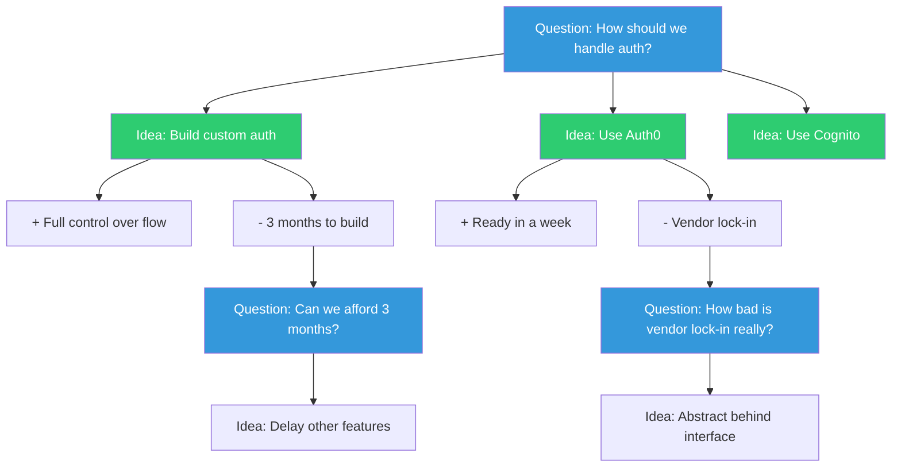

## The Move

When discussion goes in circles, stop debating and start mapping. Write the core **Question** (the issue under debate). For each question, list **Ideas** (possible responses or positions). For each idea, list **Arguments** — pros (supports) and cons (objects-to). Arguments frequently raise new questions — add those too. Draw the map on a whiteboard or document. Then inspect it for three patterns: **loops** (the same argument keeps resurfacing under different questions), **blind spots** (questions with only one idea listed), and **the real disagreement** (often it is about problem framing, not solutions).

## When to Use

- A recurring discussion that never reaches resolution
- A meeting where people talk past each other
- A decision with many stakeholders and no clear structure for the debate
- When you suspect the surface argument is masking a deeper disagreement

## Diagram

## Example

**Situation:** A team has debated for three weeks whether to migrate from REST to GraphQL. Every meeting reopens the same arguments.

**IBIS map (partial):**

- **Q: Should we migrate to GraphQL?**
  - **Idea: Yes, full migration**
    - +Arg: Solves the N+1 API call problem on mobile
    - -Arg: Team has no GraphQL experience
      - **Q: Can we train the team fast enough?**
        - Idea: Hire a GraphQL consultant for 2 months
        - Idea: Start with one non-critical service as a learning project
    - -Arg: Existing clients would need to migrate
  - **Idea: No, improve existing REST API**
    - +Arg: Less risk, team knows REST well
    - -Arg: Doesn't solve mobile over-fetching
      - **Q: Can we solve over-fetching without GraphQL?**
        - Idea: BFF pattern (Backend for Frontend)
        - Idea: Sparse fieldsets on REST endpoints
  - **Idea: Hybrid — GraphQL for new services, REST for existing**
    - +Arg: Low risk, incremental learning
    - -Arg: Two paradigms to maintain

**What the map reveals:** The debate is not actually about GraphQL vs. REST. It is about "Can we solve mobile over-fetching?" — a question with three ideas, only one of which is GraphQL. The team was stuck because they framed a solution as the question. Reframe to the real question, and the BFF pattern emerges as a contender nobody had seriously evaluated.

## Watch Out For

- The hardest part is writing the Question correctly. "Should we use GraphQL?" is a bad IBIS question — it presupposes the solution space. "How do we solve mobile over-fetching?" is better. Reframe until the question is genuinely open
- IBIS maps get large fast. Keep only the active thread visible. Archive resolved branches
- The map is a thinking tool, not a decision tool. It clarifies the structure of disagreement — you still need a decision process (e.g., a decision-maker, a vote, a time-box)
- Watch for "zombie arguments" — arguments that keep resurfacing even after being addressed. They usually signal an unstated value conflict underneath
