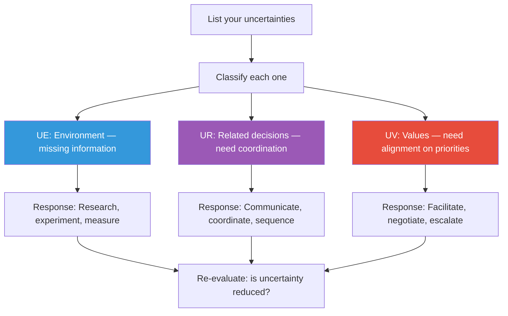

## The Move

Not all uncertainty is the same, and treating it uniformly is a planning failure. Categorize every uncertainty you face into three types: **UE (Environment)** — you lack information about the world. You need research, data, or experimentation. **UR (Related decisions)** — your decision depends on someone else's decision that has not been made yet. You need coordination, communication, or sequencing. **UV (Values)** — you are uncertain about what matters most, whose priorities win, or what trade-offs are acceptable. You need stakeholder alignment, policy guidance, or explicit prioritization. Each type demands a DIFFERENT response: UE calls for research, UR calls for communication, UV calls for facilitation. Most planning failures come from treating all uncertainty as UE ("we need more data") when the real blocker is UR or UV.

## When to Use

- A decision is stuck and "more research" is not helping
- Different team members keep raising qualitatively different concerns
- You are conflating technical uncertainty with organizational uncertainty
- A planning process keeps cycling without converging

## Diagram

## Example

**Decision:** "Should we migrate from AWS to GCP?"

**Uncertainty inventory:**

| # | Uncertainty | Type | Wrong Default Response | Right Response |
|---|-----------|------|----------------------|----------------|
| 1 | Will GCP perform better for our workloads? | UE | — | Run benchmarks on representative workloads |
| 2 | The data team is also evaluating BigQuery vs. Redshift — their choice affects ours | UR | "We need more data about GCP" | Talk to the data team NOW and align timelines |
| 3 | How much downtime is acceptable during migration? | UV | "We need to research zero-downtime migration patterns" | Get the CEO to state an acceptable downtime window |
| 4 | What are GCP's egress costs for our data volume? | UE | — | Calculate based on current AWS egress logs |
| 5 | Does the CTO actually want this, or is it just one VP's preference? | UV | "Let's do more technical analysis" | Escalate and get explicit executive alignment |
| 6 | The compliance team hasn't reviewed GCP's SOC 2 posture for our use case | UR | "We need more data about GCP security" | Schedule a meeting with compliance this week |

**Diagnosis:** Two of the six uncertainties are UE (solvable with research). Two are UR (solvable with communication). Two are UV (solvable with stakeholder alignment). But the team has been treating ALL SIX as UE — running more benchmarks, reading more GCP documentation, producing more comparison spreadsheets. The decision is stuck not because of missing data, but because nobody has talked to the data team (#2), gotten a downtime tolerance from leadership (#3), confirmed executive sponsorship (#5), or looped in compliance (#6). The research they need takes days. The conversations they need take hours.

## Watch Out For

- The most common error is treating UV as UE. "We don't know if we should prioritize speed or reliability" is not solved by researching speed vs. reliability trade-offs. It is solved by deciding what the organization values more. No amount of data resolves a values question
- UR uncertainty is invisible to solo planners. If you are planning alone, you will systematically miss the decisions that other people or teams need to make that affect yours. Ask: "Whose decisions am I waiting on?"
- Some uncertainties are genuinely mixed. "Will users adopt this feature?" is UE (you can research it) but also UV (how much adoption is enough?). Triage the components separately
- Do not use uncertainty triage to avoid research. Some problems ARE genuinely UE, and the answer is to go do the work. This tool prevents you from defaulting to research when the real blocker is elsewhere
