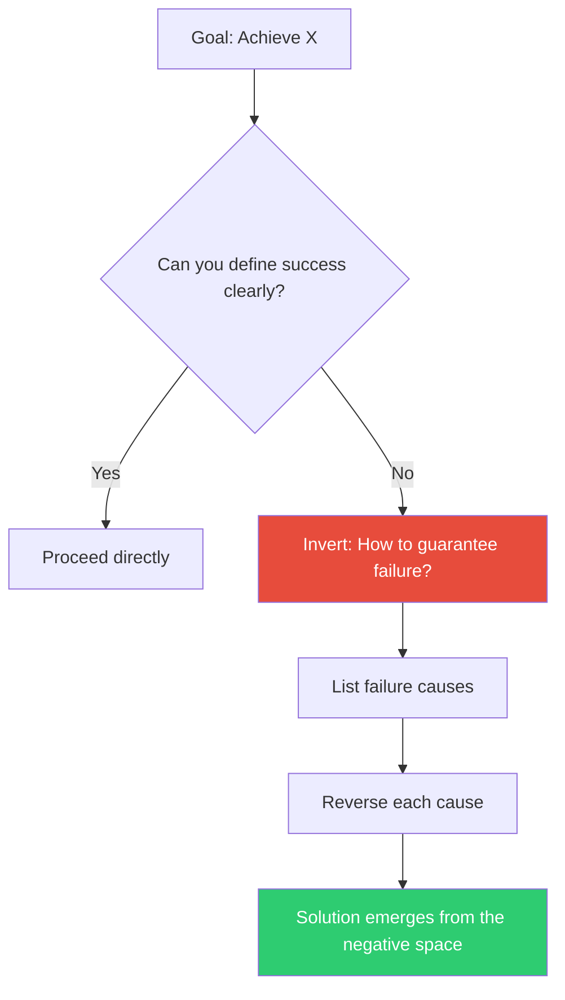

## The Move

Instead of asking "How do I achieve X?", ask "How would I guarantee X fails?" List every way to make the outcome terrible. Then systematically avoid or reverse each failure cause.

This works because failure modes are concrete and specific, while success is often vague. Your brain (or model) can enumerate what's wrong more easily than what's right.

## When to Use

- You've been approaching a problem head-on and making no progress
- The goal feels too abstract to act on ("make it better", "improve the UX")
- You're in evaluate mode and want to stress-test a draft — invert to find its weaknesses

## Diagram

## Example

**Goal:** "Design a good onboarding flow."
**Inverted:** "How would I guarantee users abandon onboarding?"
- Require 12 form fields upfront
- Don't explain why each step matters
- No progress indicator
- Force account creation before showing any value

**Reversed:** Show value first. Minimal fields. Progress bar. Explain the "why" at each step. Defer account creation.

The inverted list practically writes the solution.

## Watch Out For

- Don't get so absorbed in failure scenarios that you forget to flip back to the constructive framing
- This move is *quick* — spend 2 minutes listing failures, not 20 minutes cataloging every edge case
- If the failure list is also vague, you may need a different move (try "Reduce to the Simplest Case")
