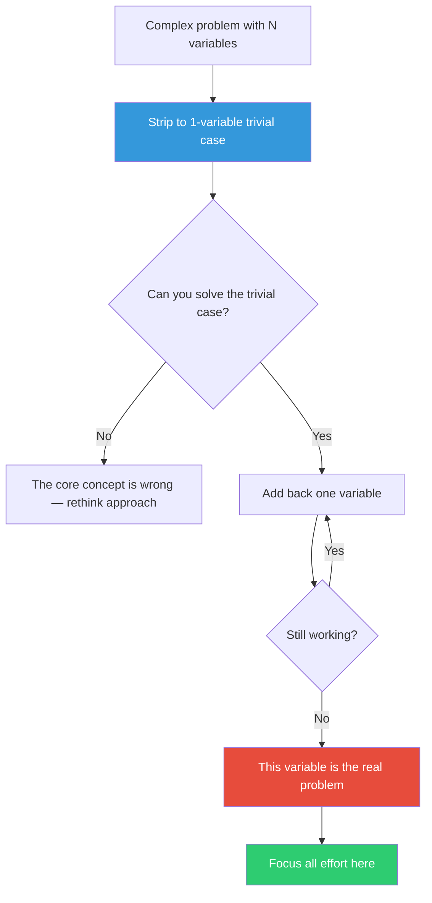

## The Move

Reduce to {{parts}} moving parts. Remove every variable, feature, and edge case until you have the dumbest possible version of the problem — one input, one output, no config, hardcoded everything. Solve that trivial version completely. Then add back one piece of complexity at a time, testing after each addition. The exact addition that breaks things (or makes you stuck again) is the real problem.

## When to Use

- The problem has so many interacting parts you can't hold it in your head
- You've been debugging for a while and still can't isolate the cause
- You're building something new and the full spec feels paralyzing
- A system works in simple tests but fails in production

## Diagram

## Example

**Problem:** "Our microservice pipeline fails intermittently — 3 services, 2 queues, a cache layer, and a database."

**Reduced:** Replace all services with a single script that reads from the DB and writes back. Does it work? Yes. Add the cache layer. Still works? Yes. Add the first queue. Still works? No — the message serialization silently drops a field when the payload exceeds 64KB.

**Result:** The bug was never "the pipeline" — it was one serialization edge case in one queue. Reducing found it in 20 minutes instead of 2 hours of log-tailing.

## Watch Out For

- The trivial case must still be the same kind of problem — don't simplify so far that you change the nature of the task
- If you can't solve the trivial case, that's valuable signal — your approach may be fundamentally wrong
- Don't skip the "add back one at a time" step; adding three things back at once defeats the purpose
- Set a timebox of 15 minutes for the full reduce-and-rebuild cycle
