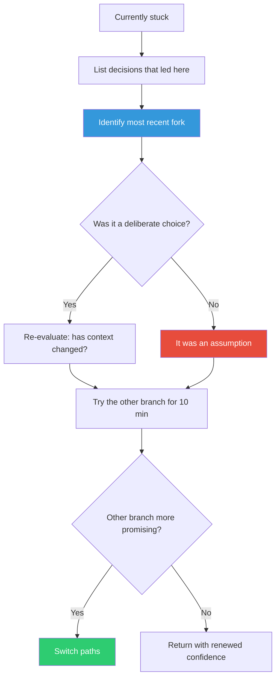

## The Move

Stop working forward. List the decisions you made to get here — framework choice, data model, algorithm, architecture, scope, even the problem framing itself. For each one, ask: "Did I choose this, or did I assume it?" Find the most recent genuine fork — a point where another option existed. Go back to that fork and try the other branch. Spend 10 minutes exploring it before deciding which path is actually better.

## When to Use

- You've been pushing forward on one approach and keep hitting resistance
- The problem felt easy at first but got progressively harder
- You're patching around something that shouldn't need patching
- You can't articulate why you chose the current approach over alternatives

## Diagram

## Example

**Situation:** You're building a recommendation engine. You chose a collaborative filtering approach on day one. Now you're three days in, struggling with sparse matrix performance, writing custom caching layers, and still getting poor results for new users.

**Backtrack:** You trace back your decisions. The fork was: collaborative filtering vs. content-based filtering. You chose collaborative because a blog post said it was "better." But your dataset has rich metadata and few users — the exact opposite of where collaborative filtering shines.

**Result:** Switching to content-based filtering eliminates the cold-start problem entirely. The sparse matrix work was never needed — you were solving an artificial problem created by an upstream decision.

## Watch Out For

- Sunk cost will scream at you — "but I already built all this." Ignore it. 10 minutes of exploration costs nothing compared to days on a dead path
- Go back far enough. The fork might not be the last decision — it might be the first one
- Don't confuse "this is hard" with "this is wrong." Some correct paths are genuinely hard. Backtrack when the difficulty feels accidental, not essential
- Write down the fork and both branches so you can compare them honestly, not from memory
