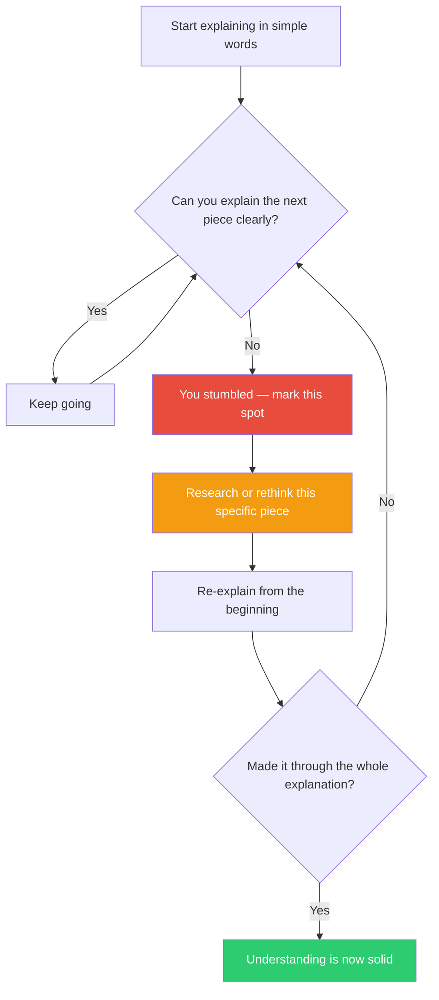

## The Move

Now explain it again in {{language.1}} — what changes when the language forces different structures? Say out loud (or write down) what you're trying to do using only plain language a ten-year-old would understand. No jargon, no acronyms, no abstractions. When you reach a point where you pause, hand-wave, or say "it basically just..." — stop. That is the exact spot where your understanding has a hole. Fill that hole (re-read, re-research, ask someone) before continuing.

## When to Use

- You've been working with complex abstractions and lost the thread
- You can describe the solution in technical terms but not in plain ones
- You're in evaluate mode and want to check whether a design actually makes sense
- You suspect you're pattern-matching from past projects without truly understanding the current one

## Diagram

## Example

**Situation:** You're implementing an event sourcing system and the projections keep getting out of sync.

**Explain it simply:** "We save every thing that happens as a note in a list. Then we read all the notes to figure out what things look like right now. The problem is... the 'figuring out' part sometimes misses notes, or reads them in the wrong... um..."

**The stumble:** You can't simply explain how the projection guarantees it processes every event exactly once. That's because it doesn't — you have no idempotency check, and replayed events get applied twice after a restart.

**Result:** The bug wasn't mysterious. You just hadn't understood your own ordering and deduplication guarantees. The simple explanation surfaced the gap in 30 seconds.

## Watch Out For

- Actually say it out loud or write it down — doing it "in your head" lets you skip the hard parts without noticing
- If your simple explanation takes more than 2 minutes, the thing you're building might be genuinely too complex — that's also useful signal
- Don't just simplify the words — simplify the concepts. "A distributed lock" explained as "a way for computers to take turns" is good; "a distributed lock but without the jargon" is cheating
- This move finds understanding gaps, not solution gaps. Once you've found the hole, you still need to fill it
