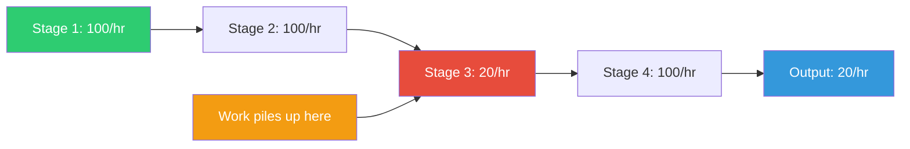

## The Move

{{persona.1}} watches your process end to end — where do they see the queue forming? Map the flow of work through your system from start to finish — every stage, handoff, and queue. For each stage, estimate throughput (how much can it process per unit of time) and observe where work piles up waiting. The stage with the lowest throughput or the longest queue in front of it is your bottleneck. Now apply the rule: any improvement not at the bottleneck is an illusion. Ignore everything else. Focus all effort on increasing the capacity of that one stage. Once it's no longer the bottleneck, find the new one and repeat.

## When to Use

- You're improving parts of a system but overall performance isn't changing
- The team is busy across the board but delivery is slow
- You need to decide where to invest limited improvement effort
- You're evaluating a system and want to find the highest-leverage intervention point

## Diagram

## Example

**Problem:** "Our feature delivery is too slow. Engineering says they need more developers. Design says they need more designers. PM says they need better requirements."

**Map the flow:**

1. **Requirements** — PM writes specs. Throughput: 5 features/week. Queue: 0 (specs available on demand).
2. **Design** — Designers create mocks. Throughput: 4 features/week. Queue: 1-2 features waiting.
3. **Engineering** — Developers build features. Throughput: 6 features/week. Queue: 0 (waiting for designs).
4. **QA** — Testers verify features. Throughput: 2 features/week. Queue: 4+ features waiting.
5. **Deploy** — Ops ships to production. Throughput: 10 features/week. Queue: 0.

**The bottleneck is QA.** Output is capped at 2 features/week no matter how fast any other stage works. Hiring more developers (Stage 3 is already at 6/week) would just make the QA queue longer.

**Fix the bottleneck:** Automate the most repetitive QA checks. Have developers write acceptance tests. Move some validation into CI. QA throughput rises to 5/week.

**New bottleneck:** Now Design at 4/week is the constraint. Repeat the process.

## Watch Out For

- People will resist the idea that their hard work on non-bottleneck stages doesn't help overall throughput. It's true anyway. Improving a non-bottleneck just builds up inventory before the bottleneck
- The bottleneck isn't always obvious. Sometimes it's a hidden dependency: a shared resource, an approval process, a single person who reviews everything
- Don't just add capacity to the bottleneck — first ask whether the work going through it is all necessary. Reducing demand on the bottleneck is often faster than increasing its capacity
- Bottlenecks shift. Once you fix one, another stage becomes the constraint. This is normal and expected — it means you're making progress
