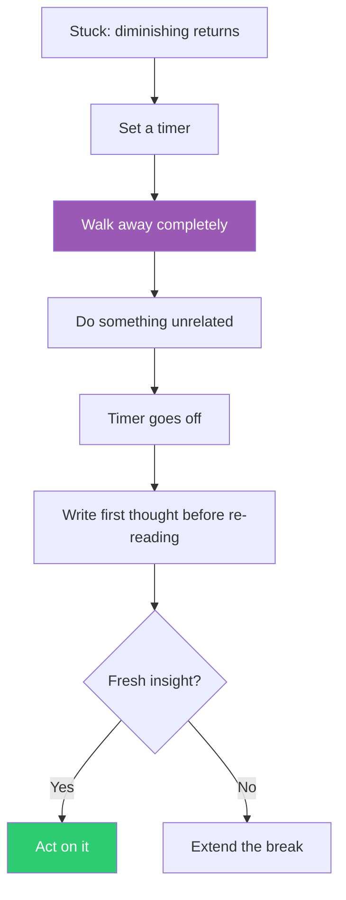

## The Move

Set a timer for 20 minutes (or longer). Close the laptop, leave the room, do something completely unrelated — walk, shower, cook, pull weeds. Do not think about the problem on purpose. Do not "take a break to brainstorm." Actually disengage.

When the timer goes off, sit back down and write the first thing that comes to mind about the problem — before re-reading any of your previous work. If nothing comes, extend the break. The cognitive science is clear: incubation periods disproportionately produce breakthroughs on problems where conscious effort has plateaued.

## When to Use

- You've been grinding on the same problem for over an hour with diminishing returns
- You're making more mistakes than progress
- You keep revisiting the same failed approaches
- Your inner monologue has become a loop

## Diagram

## Example

**Situation:** A developer has spent three hours debugging a race condition in a distributed queue. She's added logging, drawn sequence diagrams, read the source code twice. Each new hypothesis takes longer to form and test. She's now re-reading the same log output for the fourth time.

**The move:** She sets a 30-minute timer, closes the laptop, and goes for a walk around the block. She deliberately thinks about what to make for dinner. Ten minutes in, unprompted, a thought surfaces: "The consumer is acknowledging before processing completes." She hadn't considered the ack timing because her debugging was focused on the producer side.

**After the break:** She sits down, writes "check ack timing" before opening any files, and finds the bug in 5 minutes. Three hours of focused effort missed what 10 minutes of disengagement revealed.

## Watch Out For

- This is not permission to avoid hard problems. Use it after genuine effort, not instead of it
- If you're on a deadline measured in minutes, this move doesn't apply — try "Reduce to the Simplest Case" instead
- Don't "walk away" to your phone or social media. The incubation effect requires low-cognitive-load activity, not different high-load activity
- If you come back and still have nothing, the problem may need a different move entirely, not more incubation
