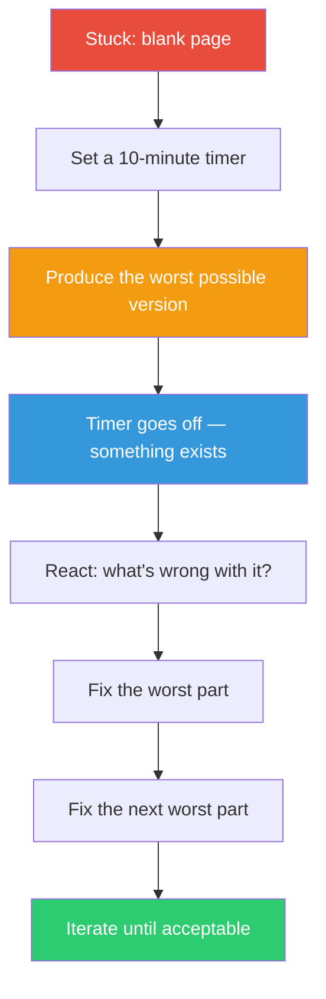

## The Move

Set a timer for 10 minutes. Produce the ugliest, most embarrassing version of the thing you're trying to make. Hardcode everything. Skip error handling. Use bad variable names. Write the cliche copy. Make the layout hideous. The only rule is: it must exist when the timer goes off. Once you have a bad version, your job changes from "create something from nothing" to "improve something that exists" — and that is a fundamentally easier task.

## When to Use

- You've been staring at a blank file, blank canvas, or blank doc for more than 5 minutes
- You keep deleting your first attempts because they aren't good enough
- You know roughly what to build but can't commit to a starting point
- The quality bar in your head is paralyzing you

## Diagram

## Example

**Situation:** You need to write an API endpoint for user search, but you keep going back and forth on query parsing, pagination strategy, and response format.

**Make it ugly:** In 10 minutes, you write a handler that takes a `q` parameter, does `SELECT * FROM users WHERE name LIKE '%q%'`, returns all results as a raw JSON array with no pagination, no input validation, and the database password hardcoded in the file.

**React to it:** Looking at the ugly version, you immediately see: (1) you need parameterized queries, (2) cursor-based pagination is the obvious fit because results are sorted by name, (3) the response should be wrapped in an envelope with a `next_cursor` field. These decisions that felt paralyzing in the abstract are now obvious when you're reacting to something concrete.

**Result:** The ugly version took 10 minutes. Cleaning it up took 30 minutes. Total: 40 minutes. Staring at the blank file had already cost you an hour.

## Watch Out For

- You must actually commit to ugly. If you find yourself "just quickly" adding error handling, you're not doing the move — you're procrastinating with style
- The ugly version is a scaffold, not a prototype. Don't show it to anyone or ship it. Tear it down and rebuild
- If you can't produce even an ugly version, the problem isn't perfectionism — you might not understand the problem yet. Try TF-014 (Explain It to a Child) instead
- Some people need to delete the ugly version before they can write the real one. That's fine. The ugly version did its job by unsticking you
