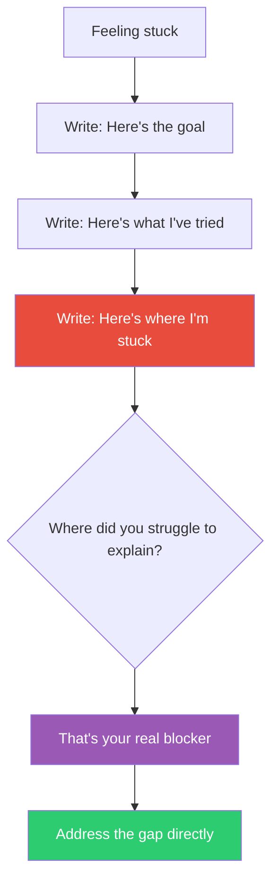

## The Move

Write the explanation for {{persona.1}} — what would they need to hear? Write a brief explanation of your problem structured in exactly three parts: (1) "Here's the goal — what I'm trying to achieve and why it matters." (2) "Here's what I've tried — the approaches I've taken and what happened." (3) "Here's where I'm stuck — the specific point where I can't make progress."

Write it as if you're explaining to a colleague who is smart but knows nothing about this particular problem. Use no jargon without defining it. The act of structuring your explanation for someone else forces you to organize your own thinking — and the point where you struggle to explain clearly is almost always the point where your understanding has a gap.

## When to Use

- You feel stuck but can't name the specific blocker
- Your thinking has become circular and you've lost the thread
- You're about to ask for help and want to make the most of it
- The problem has been in your head too long and needs to be externalized

## Diagram

## Example

**Situation:** A backend developer has been stuck for two hours on a performance issue. "The API is slow" is all she can say when asked.

**Teaching it:**

> **Goal:** Our product search API needs to return results in under 200ms. It currently takes 800ms for queries with more than two filters applied. This matters because the frontend shows a loading spinner and users bounce after 500ms.
>
> **What I've tried:** I added database indexes on the three most-filtered columns — brought it from 1200ms to 800ms. I tried query caching with Redis but cache hit rates are only 8% because the filter combinations are too diverse. I profiled the query and the database time is only 150ms.
>
> **Where I'm stuck:** Wait. If the database only takes 150ms, where are the other 650ms going?

**Result:** The act of writing "the database time is only 150ms" next to "the API takes 800ms" made the gap visible for the first time. She'd been optimizing the database for two hours when the bottleneck was in the application layer — serialization and middleware. She found it in 15 minutes once she looked in the right place.

## Watch Out For

- Actually write it down. Thinking it in your head defeats the purpose — the value is in the translation from thought to structured text
- If you can explain all three parts clearly and you're still stuck, the problem may require new information, not better organization. Go ask someone or read the docs
- Don't over-polish the explanation. This is a thinking tool, not documentation. Rough and honest beats clean and vague
- This move pairs well with actually sending the explanation to someone. Often you'll solve it while writing, but if not, you now have a great question to ask
