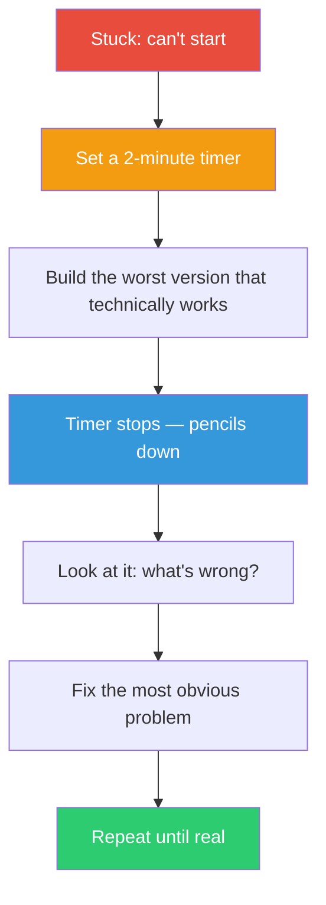

## The Move

Set a 2-minute timer. Build the crappiest possible version that technically addresses the problem. Not a plan, not a sketch, not pseudocode — an actual attempt. When the timer stops, pencils down. You now have something concrete to react to. The question shifts from "what should I do?" to "what's wrong with this?" — and that second question is dramatically easier to answer.

## When to Use

- You've spent more time thinking about how to start than it would take to just start badly
- You keep reaching for plans, outlines, or research instead of producing output
- The problem feels too large or ambiguous to approach directly
- You want momentum more than correctness right now

## Diagram

## Example

**Situation:** You need to design a notification system for a SaaS app. You've been going back and forth on event sourcing vs. a message queue, delivery guarantees, user preference modeling, and batching strategies for 45 minutes.

**Two-minute version:** You write a function that takes a user ID and a string, inserts a row into a `notifications` table, and on page load you `SELECT * FROM notifications WHERE user_id = ? AND read = false`. No queue. No batching. No preferences. A single database table and two queries.

**React to it:** Looking at this sad little system, you immediately see: (1) polling the database on every page load is the first thing to fix, (2) you need a `type` column so the frontend can render different notification styles, (3) batching only matters for email, not in-app, so that's a separate concern. The architecture decisions that felt paralyzing are now obvious because you can see them against something concrete.

**Result:** The 2-minute version wasn't the answer. But it converted 45 minutes of circular deliberation into 5 minutes of targeted critique.

## Watch Out For

- Two minutes means two minutes. If you're going over, you're polishing, which defeats the purpose. The constraint is the mechanism
- This is different from TF-039 (Make It Ugly First) — that gives you 10 minutes and focuses on overcoming perfectionism. This gives you 2 minutes and focuses on overcoming analysis paralysis. The shorter timer forces you to skip all deliberation
- The 2-minute version is disposable. Don't let it anchor your thinking — it's a conversation starter, not a foundation
- If you can't build anything in 2 minutes, your problem might be too vaguely defined. Try TF-047 (Rewrite the Constraints) to clarify what you're actually solving
