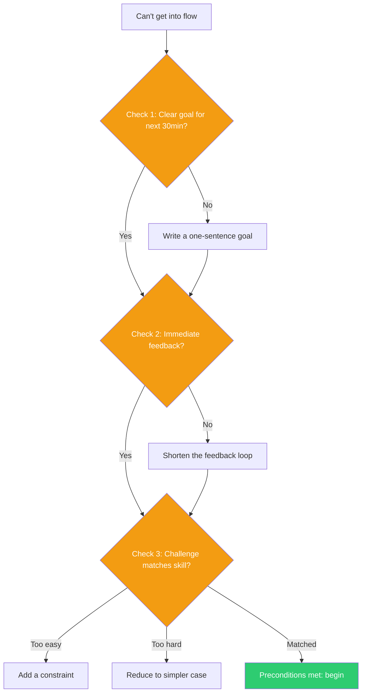

## The Move

Flow requires three preconditions. Check which one is missing:

**(1) Clear goals.** Do you know, right now, what "done" looks like for the next 30 minutes of work? Not the project goal — the immediate next outcome. If you cannot state it in one sentence, write one. "By 3pm I will have a working test for the payment retry logic."

**(2) Immediate feedback.** Can you tell, moment to moment, whether you are making progress? If you are writing code, can you run it? If you are designing, can you see the result? If feedback is delayed (compile takes 5 minutes, deploy takes 20), shorten the loop. Work in a REPL. Use a preview. Create a faster proxy for progress.

**(3) Challenge matched to skill.** Is the task too easy (boredom) or too hard (anxiety)? If too easy, add a constraint — a time limit, a performance target, an elegance requirement. If too hard, reduce scope until the next step is something you know how to do, then build back up.

Fix the missing precondition. Do not try to force focus through willpower — fix the environment.

## When to Use

- You are struggling to start or maintain focus on a task
- You keep switching to easier or more stimulating tasks
- The work feels like pushing through mud even though the task is not objectively hard
- You had flow earlier on this project and lost it

## Diagram

## Example

**Situation:** You need to write integration tests for a microservice. You have been "about to start" for 45 minutes, checking Slack and reading documentation instead.

**Check 1 — Clear goal?** "Write integration tests" is too vague. Which tests? For which endpoints? You set a specific goal: "Write a test that verifies the /orders endpoint returns 200 with valid auth and 401 without."

**Check 2 — Immediate feedback?** The test suite takes 3 minutes to run because it spins up Docker containers. That is too slow for flow. You configure a single-test run command that uses an already-running local database: execution drops to 4 seconds.

**Check 3 — Challenge-skill match?** Now it is slightly too easy — you have written hundreds of auth tests. You add a constraint: write the test using property-based testing instead of fixed inputs. That moves it from routine to engaging.

**Result:** Three targeted fixes took 10 minutes. After that, you work uninterrupted for 90 minutes.

## Watch Out For

- This move sets preconditions, not guarantees. Flow is an emergent state, not a switch you flip. But without these preconditions, it will not emerge at all
- "Too hard" does not mean the project is too hard — it means the NEXT STEP is too hard. Break it down until the next action is within your current capability
- Do not use this as procrastination. The diagnosis should take 2 minutes. If you spend 20 minutes analyzing your flow state, you have replaced one form of avoidance with another
- External interruptions (notifications, open offices, meetings) defeat flow regardless of preconditions. Fix the environment first if interruptions are the real problem
