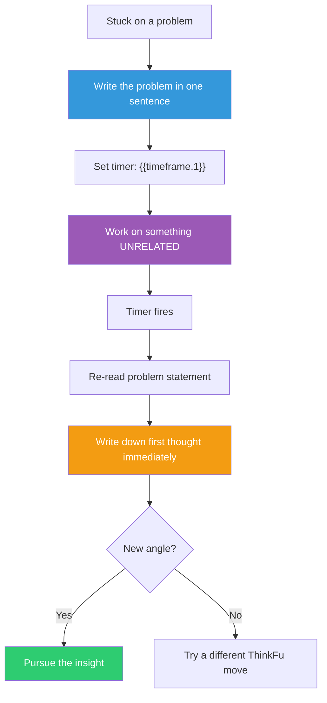

## The Move

This is not "take a break." This is structured incubation — a specific protocol backed by research:

**(1)** State the problem clearly in writing. One sentence. The act of crystallizing the problem primes what comes next.

**(2)** Set a boundary of **{{timeframe.1}}**. If that duration is impractical, use 20 minutes as a default.

**(3)** Work on something COMPLETELY unrelated. Not a variant of the same problem. Not a related feature. Something in a different cognitive domain — a different project, a code review for another team, a task with different constraints and different patterns. Sio & Ormerod's meta-analysis found the incubation effect is strongest when the break involves active work in a different domain, not passive rest. The cross-domain work is the point: it loads different patterns that may cross-pollinate when you return.

**(4)** When the time is up, re-read your one-sentence problem statement. What is the first thing that comes to mind? Write it down immediately, before your analytical process kicks in and starts filtering.

## When to Use

- You have been working on the same problem for more than 30 minutes without progress
- You keep reaching the same dead end through different paths
- The problem requires creative insight rather than grinding execution
- You notice your thinking becoming repetitive or circular

## Diagram

## Example

**Situation:** You are trying to design a rate-limiting system that handles both per-user and global rate limits without double-counting. You have been at it for 40 minutes. Every approach either double-counts shared resources or requires a two-phase check that adds latency.

**Step 1 — Write it down:** "Design rate limiting that handles per-user and global limits without double-counting or adding a synchronization step."

**Step 2 — Set timer:** {{timeframe.1}} (or 20 minutes if impractical).

**Step 3 — Work on something else:** You switch to reviewing a colleague's PR on the notification system. It uses an event-sourcing pattern where events are immutable and state is derived.

**Step 4 — Timer fires. Re-read.** First thought: "What if rate limit counters are events, not state? Each request emits a 'consumed' event. Per-user and global views are just different projections over the same event stream. No double-counting because there is only one counter — you just query it differently."

The notification PR's event-sourcing pattern leaked into your unconscious processing of the rate-limiting problem. This cross-pollination is exactly what structured incubation enables.

## Watch Out For

- Do not skip step 1. Writing the problem in one sentence is not optional — it primes the incubation. Without it, your unconscious has nothing specific to work on
- The break activity matters. Scrolling social media is too passive. Doing intense work in the same domain is too close. The sweet spot is mild cognitive effort in a different domain
- Incubation does not always produce insight. If nothing surfaces after the timer, do not repeat — try a different move instead (TF-001, TF-009, TF-012)
- Do not use incubation as avoidance. If you have not spent at least 20 minutes of focused effort on the problem first, you are not stuck — you have not started. Incubation works because your conscious mind has already loaded the problem deeply; the break lets unconscious processing take over
- Write down whatever comes to mind at step 4, even if it seems wrong or incomplete. The analytical filter kills fragile insights
