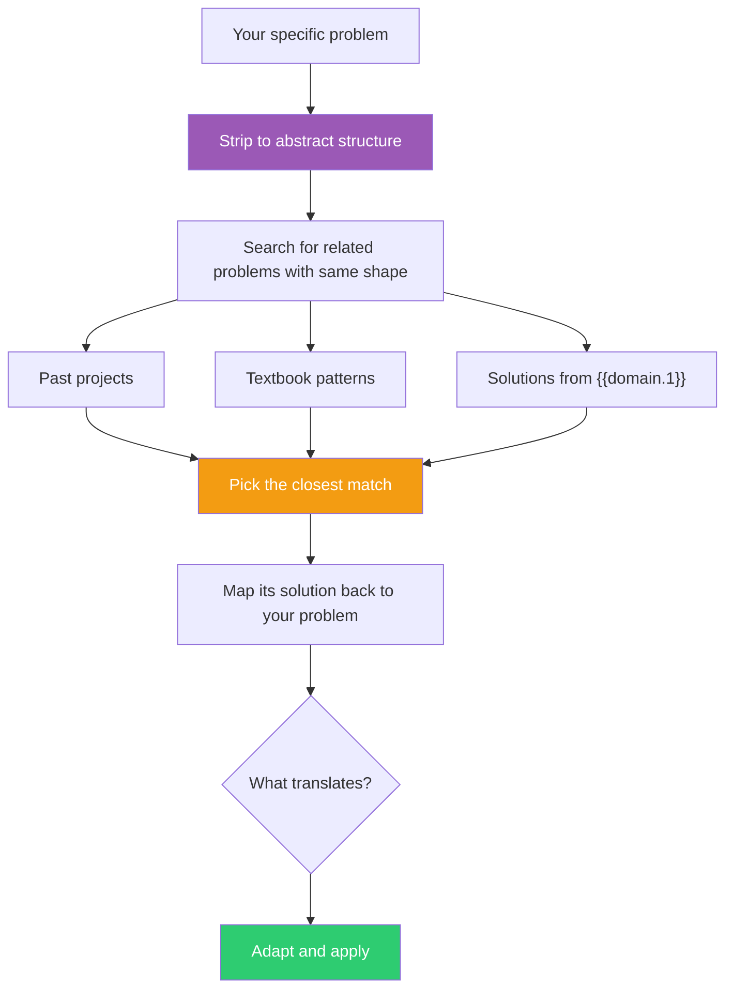

## The Move

Stop trying to solve your problem directly. Instead, strip it to its abstract structure: ignore domain-specific names and describe the shape. "I need to synchronize state between two systems that can't communicate directly" or "I need to find the optimal allocation of limited resources across competing demands." Schon called this "seeing-as" — experts don't reason from first principles; they see new situations AS familiar ones from a repertoire built over years. Now search your memory for problems with that same shape: past projects, textbook problems, patterns from {{domain.1}}, or classic computer science solutions. Name the analogy explicitly: "This is like [X] because [structural similarity]." Write down the related problem and its known solution. Then stress-test: **where does this analogy break down?** The breakdown points are where the genuinely new aspects of your problem live. Finally, map the solution back to your specific case: what translates directly? What needs adaptation at the breakdown points? What doesn't map at all?

## When to Use

- You're stuck on a problem that feels novel but probably isn't
- You've been staring at the specifics too long and need to zoom out to the pattern
- You're working in an unfamiliar domain but suspect the underlying structure is something you've seen
- You want to leverage existing solutions rather than inventing from scratch

## Diagram

## Example

**Problem:** "We need to roll out a feature to users gradually, monitoring for errors, and automatically rolling back if error rates spike. I've never built this before."

**Abstract structure:** "Gradually transition from state A to state B while monitoring a health signal, and revert if the signal degrades." This is NOT a novel problem.

**Related problems found:**
1. **Canary deployments** — same structure: route a small percentage of traffic to the new version, monitor error rates, roll back automatically if unhealthy. Solution: percentage-based routing with health checks.
2. **A/B testing** — similar structure: split traffic between variants, measure outcomes, pick the winner. Solution: feature flags with percentage rollouts and metric tracking.
3. **Thermostat control** — from a different domain: measure temperature, adjust heating, measure again. Solution: feedback loop with a threshold and a response action.

**Mapping back:** The canary deployment pattern maps closest. We adapt it: instead of routing to a new server, we use a feature flag with a percentage ramp. Instead of monitoring HTTP 500s, we monitor our domain-specific error signal. The rollback mechanism is the same: if error rate exceeds threshold for N minutes, set the flag to 0%.

**What we learned:** The team was trying to design a custom "gradual rollout with monitoring" system from scratch. The related problem — canary deployments — already has mature, proven solutions. We used an existing feature-flag service with built-in metric gates instead of building anything.

## Watch Out For

- The related problem's solution is a starting point, not an answer. You must adapt it to your specific constraints — blind copying leads to misfit solutions
- Don't force a match. If the abstract structures are only superficially similar, the related solution will mislead more than help
- Sometimes the most useful related problem is from a completely different domain. Don't limit your search to your own field
- If you can't find a related problem, that's valuable information: your problem may genuinely be novel, and you should switch to a different unsticking strategy
