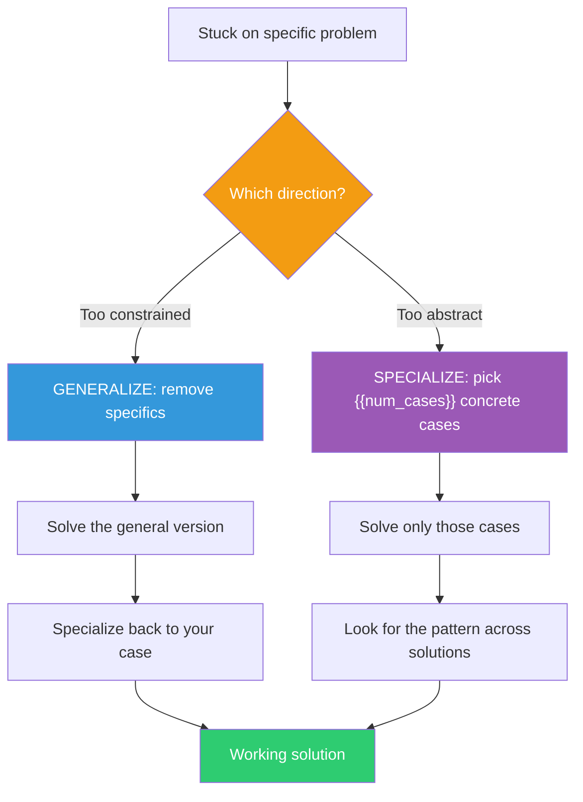

## The Move

You have a specific, concrete problem and you're stuck. Try two opposite moves. First, GENERALIZE: remove specific details from your problem until you reach a version that applies to a whole class of situations. "Build a dashboard for sales data" becomes "build a system that presents any dataset." The general version is often easier because you have more freedom — you're not tangled in specifics. Solve the general case, then specialize it back to your original problem. If generalizing doesn't help, try the OPPOSITE: specialize further. Pick just {{num_cases}} concrete cases and solve only those. "Build a system for any dataset" becomes "build a page that shows this one CSV." A working specific solution often reveals the path to the general one.

## When to Use

- When specific requirements make the problem feel impossibly constrained
- When you're stuck on edge cases and can't see the core algorithm
- When the problem feels too "custom" to have a pattern
- When you've been going back and forth between approaches and none fit the specifics

## Diagram

## Example

**Problem:** "We need to build a notification system that sends emails when an order ships, SMS when a delivery is attempted, push notifications when a review is requested, and Slack messages when a refund is processed. Each has different templates, different triggers, and different retry logic."

**Stuck because:** Four specific notification types with four sets of rules feels like four separate systems.

**GENERALIZE:** Strip the specifics. The general problem is: "When event X occurs, send message Y through channel Z with retry policy R." That's a single system with four configuration entries, not four systems.

**General solution:**
- An event listener that maps event types to notification configs
- A notification config: `{event, channel, template, retry_policy}`
- A channel abstraction: anything that implements `send(recipient, rendered_message)`
- A retry engine that takes a policy and executes it

**Specialize back:**
- `{order_shipped, email, shipping_template, retry_3x_exponential}`
- `{delivery_attempted, sms, delivery_template, retry_1x_immediate}`
- `{review_requested, push, review_template, no_retry}`
- `{refund_processed, slack, refund_template, retry_3x_linear}`

**What we learned:** The specific problem looked like four separate features. The general problem revealed it was one feature with four configurations. Generalizing reduced the work by roughly 60% and made the system extensible — adding a fifth notification type is now a config entry, not a project.

**When specializing helps instead:** If the team had started with the general "notification framework" and gotten lost in abstraction, the move would be: "Forget the framework. Just make the order-shipped email work. Hard-code everything. Now look at what you built and ask what would change for SMS." Building {{num_cases}} specific cases first often reveals the right abstraction naturally.

## Watch Out For

- Generalizing too far creates "architecture astronaut" solutions — infinitely flexible frameworks that solve no specific problem well
- Specializing too far creates "works on my machine" solutions that break on the next case. Always check at least 2-3 cases
- The Polya paradox: a more general problem can be EASIER because constraints that made the specific version hard disappear. But this only works if the general problem is well-defined, not vague
- Know when to switch direction. If generalizing for 20 minutes hasn't helped, try specializing (and vice versa). Don't commit to one direction stubbornly
