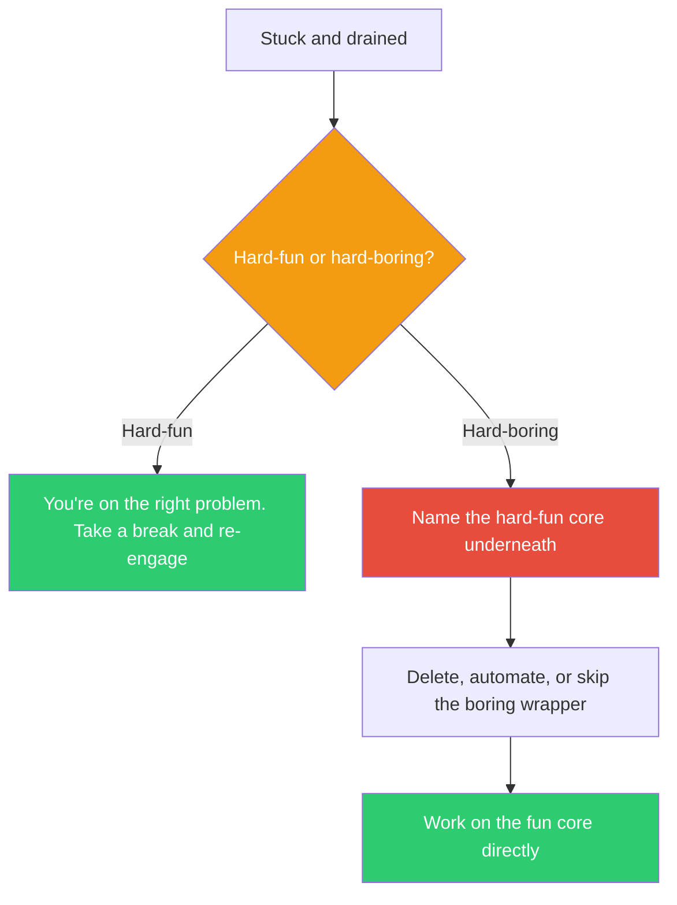

## The Move

Ask yourself one question: is this hard-fun or hard-boring? Hard-fun is struggle with agency — you're challenged, the problem resists you, but you're engaged because the challenge connects to something you care about. Hard-boring is struggle without agency — you're fighting configuration files, waiting for builds, navigating bureaucracy, or doing repetitive tasks that a machine should do. If it's hard-boring, you're stuck on the WRONG problem. Name the hard-fun version — the genuinely interesting core challenge buried under the tedium — and find a way to work on that directly. Automate, skip, delegate, or delete the hard-boring wrapper.

## When to Use

- You've been stuck for over an hour and feel drained rather than energized
- The problem is technically challenging but you have zero motivation to solve it
- You suspect you're yak-shaving — solving problems that are prerequisites to prerequisites
- You need to diagnose whether the blocker is intellectual (hard-fun) or procedural (hard-boring)

## Diagram

## Example

**Situation:** A developer has spent 4 hours trying to set up a local Kubernetes cluster to test a new service mesh configuration. He's on his third attempt at getting the TLS certificates to work. He's frustrated and making no progress.

**Hard-fun or hard-boring?** The actual challenge he cares about is: "Can our services gracefully degrade when the mesh's control plane goes down?" That's hard-fun — it's a genuinely interesting distributed systems question. But he's spent the entire day on TLS certificate configuration, DNS resolution in the local cluster, and version compatibility between tools. That's hard-boring — it's infrastructure yak-shaving with no intrinsic interest.

**Finding the fun core:** He skips the local cluster entirely. He writes a simple test harness using mock services that simulate mesh behavior — control plane up, control plane down, partial failure. He can test the graceful degradation logic in 30 minutes without any certificates. The fun problem (failure modes) is solved in an hour. The boring problem (local K8s setup) is delegated to a teammate who already has a working config.

## Watch Out For

- Hard-fun can BECOME hard-boring after too long. If you've been stuck on a genuinely interesting problem for 6 hours, take a break. The fun returns after rest
- Don't use this as an excuse to skip necessary but unglamorous work. Sometimes the boring part is the actual job. The test is: does the boring part have to be done BY YOU, RIGHT NOW?
- Some problems are hard-boring for you but hard-fun for someone else. That's called delegation, and it's not laziness — it's resource allocation
- The hard-fun core is often smaller than you think. "Build a distributed database" is mostly hard-boring (consensus protocol implementation, storage engine, wire format). The hard-fun part might be one specific design decision. Find it
