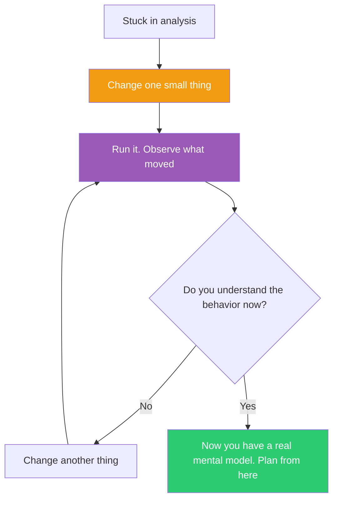

## The Move

Change one thing inspired by {{word.1}}. What moved? Stop whatever planning, analyzing, or diagramming you're doing. Weick's radical insight: in ambiguous situations, you do not analyze then act — you ACT then make sense of what happened. "How can I know what I think till I see what I say?" The environment does not reveal its structure to passive observers. It reveals structure in RESPONSE to action. Open the code, the config, the system. Change one small thing — a parameter, a function call, a flag, a constant. Run it. Observe what changed — and critically, observe how the environment RESPONDS. You're not testing a hypothesis. You're probing the system to learn how it actually behaves. What surprised you? What did the response reveal that you could not have learned from more analysis? Change another thing. Observe again. After 3-5 changes, you'll know more about the system's real behavior than an hour of reading code would have taught you. Tinkering is a legitimate methodology — it works when the system is too complex, too undocumented, or too surprising for pure reasoning. The action creates the information you could not get from thinking alone.

## When to Use

- You've been reading code for 30+ minutes and still don't understand the behavior
- The documentation is outdated, missing, or wrong
- The system has emergent behavior that can't be predicted from the source
- Analysis paralysis has set in and you need to break the loop

## Diagram

## Example

**Situation:** A developer inherits a legacy data pipeline. There are 3,000 lines of configuration across 12 YAML files. The documentation is 2 years out of date. She needs to add a new data source but doesn't understand how existing sources are routed.

**Tinkering instead of planning:** Instead of reading all 12 YAML files, she: (1) Adds a fake data source called "test_tinker" with minimal config, copying from an existing one. Runs it. Error: "missing schema registry entry." Now she knows the schema registry is checked first. (2) Adds a dummy schema entry. Runs it. The data appears in a staging table she didn't know existed. Now she knows about the staging layer. (3) Changes the routing key in the config from "default" to "nonexistent." Error message reveals the three valid routing paths and where they're defined. (4) Changes the batch size to 1. Watches a single record flow through the system end-to-end. Now she can see every transformation step.

**Result:** In 20 minutes of tinkering, she mapped the entire pipeline's actual behavior — staging tables, schema validation, routing paths, transformation steps. Reading the YAML files would have given her the intended behavior. Tinkering gave her the actual behavior, including three undocumented staging tables and a routing path that the YAML comments said was "deprecated" but was actually handling 40% of traffic.

## Watch Out For

- Tinker in a safe environment. Don't probe production by changing things and seeing what breaks. Use a dev instance, a copy, a sandbox
- Tinkering without observability is just poking in the dark. Make sure you can see the effect of your changes — combine with "Make the Invisible Visible" (TF-080)
- Know when to stop tinkering and start planning. Tinkering builds intuition; planning builds structure. After 30 minutes of tinkering, you should know enough to plan
- Don't confuse tinkering with hacking. Tinkering is exploratory and temporary — you're learning, not building. Revert your changes when you're done exploring
