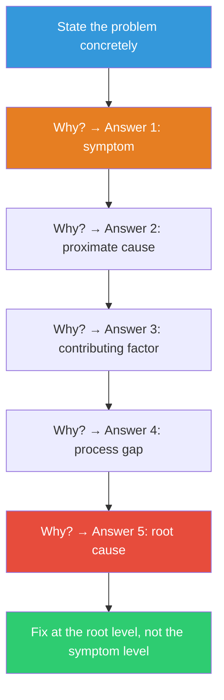

## The Move

Ask 'why?' {{depth}} times. State the problem in one concrete sentence — not "things are slow" but "the checkout page takes 4 seconds to load." Ask "Why?" and write the answer. Ask "Why?" of that specific answer. Repeat until you've asked five times. Each "why" must target the previous answer specifically, not the original problem. Don't ask "why" in the abstract — ask "why did THAT happen?" If a "why" has multiple answers, pick the one that's most within your control and continue that branch. The first why gives a symptom. The second gives a proximate cause. By the fifth, you're usually at a structural or process-level root cause.

## When to Use

- A problem recurs despite being "fixed" multiple times
- You know the symptoms but haven't traced them to a root cause
- Post-incident, when you need to go deeper than "the server crashed"
- You're about to fix something and want to make sure you're fixing the right thing
- A bug feels like it shouldn't exist and you want to understand the system failure that allowed it

## Diagram

## Example

**Problem:** "Customers are seeing stale product prices on the storefront."

1. **Why are prices stale?** Because the cache is serving old data.
2. **Why is the cache serving old data?** Because cache invalidation isn't triggered when prices change in the admin panel.
3. **Why isn't invalidation triggered?** Because the price update goes through a bulk import endpoint that bypasses the normal update hooks.
4. **Why does the bulk import bypass the hooks?** Because it was written as a quick script during launch to handle a one-time data migration, and it was never refactored into the standard pipeline.
5. **Why was it never refactored?** Because there's no process for tracking temporary workarounds and retiring them. The team doesn't have a "tech debt register" and launch hacks become permanent by default.

**Root cause:** Not the cache. Not the endpoint. The root cause is that the team has no mechanism for tracking and retiring temporary workarounds. Fixing the cache invalidation for this endpoint solves today's bug. Creating a tech debt register and review process prevents the next ten bugs like it.

## Watch Out For

- The most common failure is asking "why" of the original problem each time instead of the previous answer. Each "why" must chain from the last answer specifically
- Five is a guideline, not a rule. Sometimes you hit root cause at three. Sometimes you need seven. Stop when you reach something structural that, if changed, would prevent the entire chain
- Don't let "why" become "whose fault." The goal is to find systemic causes, not to assign blame. If your fifth why is a person's name, you went wrong — ask why the system allowed that person to make that mistake
- When a "why" has multiple valid answers, you're at a branch point. You might need to follow multiple branches to find which root cause is most actionable
- This move finds ONE root cause along ONE causal chain. Complex problems often have multiple contributing chains. Consider running it multiple times from different starting points
