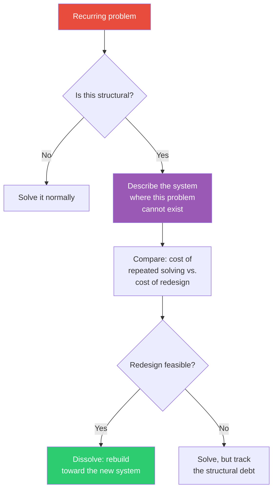

## The Move

State the problem. Now ask: "In what redesign of the surrounding system would this problem simply not arise?" You are not looking for a solution — you are looking for a system in which the question has no meaning. Describe that system concretely. Then evaluate: is it cheaper to keep solving the problem, or to rebuild toward the dissolution?

Ackoff distinguished three responses to problems: resolve (good enough), solve (optimal answer), and dissolve (change the system so the problem disappears). Most people stop at solving. Dissolution is the highest-leverage move.

## When to Use

- A problem keeps recurring despite repeated fixes
- Every proposed solution creates a new, equally annoying problem
- You suspect the problem is structural, not incidental
- The effort spent managing the problem exceeds the effort to redesign around it

## Diagram

## Example

**Problem:** "Our microservices keep getting out of sync on schema changes. Every time service A changes its API, services B, C, and D break."

**Solving:** Add integration tests, contract testing, version negotiation, changelog enforcement, breaking change alerts.

**Dissolving:** What if the schema were not duplicated across services at all? If all services read from a single schema registry at build time and generated their clients automatically, there is no "sync" to maintain. The problem of "services getting out of sync" literally cannot arise because there is only one source of truth and no manual copying.

**Cost comparison:** The solving approach requires ongoing vigilance and tooling maintenance. The dissolving approach requires a one-time migration to schema-driven codegen. After that, the category of problem disappears.

## Watch Out For

- Dissolution often requires more upfront investment than solving. Make sure the problem recurs enough to justify the redesign
- Don't confuse "dissolve" with "ignore." Dissolution means the problem structurally cannot exist; ignoring means you've just stopped looking at it
- Some problems are genuinely incidental, not structural. Not everything needs dissolution — sometimes a quick fix is the right call
- The redesigned system will have its own problems. Make sure you're not trading a manageable problem for an unmanageable one
