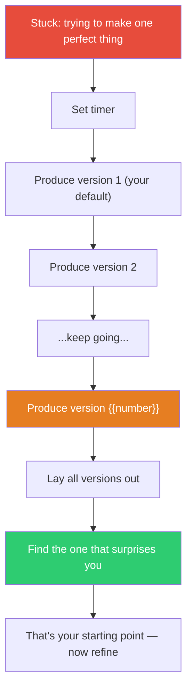

## The Move

You are trying to produce one great version. Stop. Set a timer proportional to the task (5 minutes for naming, 30 minutes for architecture, 2 hours for a design). Your goal: produce **{{number}}** versions before the timer expires. They do not need to be good. They do not need to be complete. They need to be DIFFERENT from each other. After you have {{number}} versions, lay them all out and look for the one that surprises you. It will not be the first one you made (that was your default). It will not be the last one (that was your fatigue). It will be somewhere in the middle, where your defaults ran out and your creativity took over.

## When to Use

- You are blocked by perfectionism — nothing feels good enough to commit to
- You have one idea and you keep polishing it instead of exploring alternatives
- The blank page or empty file has been staring at you for too long
- You need a creative breakthrough and deliberation is not producing one

## Diagram

## Example

**Situation:** You need to name a new internal tool that manages feature flags. You have been going back and forth on "FlagManager" for 20 minutes, knowing it is bland but unable to think of anything better.

**Quantity move — produce {{number}} names in 5 minutes:**
1. FlagManager
2. Flipswitch
3. FeatureGate
4. Toggles
5. Switchboard
6. FlagDay
7. Pennant
8. Signal
9. LaunchControl
10. Canary
11. Rollout
12. FeatureDial

**What you find:** Names 1-4 were your defaults (generic, descriptive). Names 5-8 got more interesting as you ran out of obvious options. "Switchboard" (5) evokes a telephone operator routing connections — which is exactly what a feature flag system does. "LaunchControl" (9) frames flags as a launch mechanism, not just toggles. "Canary" (10) connects to canary deployments, adding a safety connotation.

**Result:** You pick "Switchboard." You never would have reached it by polishing "FlagManager." Volume produced variety, and variety produced the unexpected option. The 20 minutes of deliberation produced nothing; 5 minutes of volume produced 12 options including 3 strong candidates.

## Watch Out For

- The goal is DIFFERENT versions, not variations. "FlagManager, FlagController, FlagService" is one idea with three spellings, not three ideas. Force yourself to change the approach, not just the surface
- Do not evaluate while producing. The inner critic must be silent during the volume phase. Judging version 3 while making version 4 defeats the mechanism
- {{number}} is a minimum, not a target. If you hit {{number}} and are still flowing, keep going
- After the volume phase, do not just pick the "best" one. Look for the surprising one — the version that makes you think "I didn't know I had that idea." That is the signal that volume pushed you past your defaults
