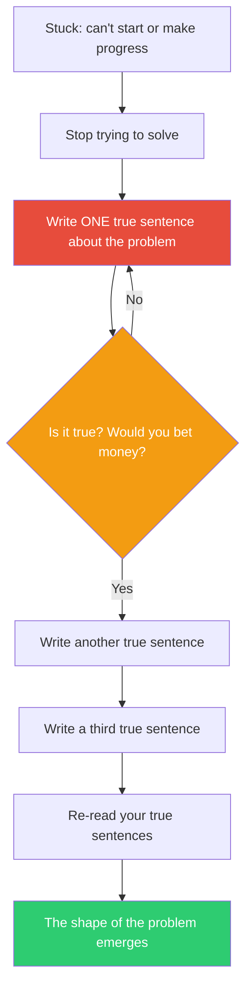

## The Move

Hold this while writing: **{{koan.1}}** Stop trying to solve, plan, or design. Write one sentence about this problem that you are certain is true. Not clever, not comprehensive — factually correct and non-trivial. Something you would bet money on. Then write another. Then another. After three to five true sentences, re-read them: the shape of the problem will have emerged, and you will know where to go next.

The discipline is truthfulness. Most stuckness comes from trying to write something good before you have written anything true. Hemingway used this technique every morning to break through the blank page. The act of committing to a single true claim forces you to separate what you know from what you are guessing.

## When to Use

- You have been stuck for more than five minutes without producing anything
- Your draft or plan keeps expanding but nothing feels solid
- You are paralyzed by the number of possible starting points
- You suspect you understand the problem but cannot articulate it

## Diagram

## Example

**Situation:** You need to design a caching strategy for a product catalog service. You have been going back and forth between Redis, in-memory caches, CDN caching, and various invalidation strategies for 20 minutes without making a decision.

**One true sentence:** "The product catalog changes at most a few times per day, but is read thousands of times per second."

**Another:** "A user seeing a stale price for 60 seconds is annoying; seeing a stale price for 24 hours would cause support tickets."

**Another:** "We already have Redis in the infrastructure; adding a new caching layer means a new thing to operate."

**Re-read:** The problem is now clear. You need a cache with a TTL between 60 seconds and 24 hours, and Redis is the pragmatic choice because it is already available. The three true sentences eliminated the CDN-only approach (staleness risk too high) and the in-memory-only approach (no shared invalidation) without you needing to formally evaluate either.

## Watch Out For

- "True" means factually verifiable, not "sounds reasonable." "Our users want fast responses" is vague. "P95 latency is currently 800ms and the SLA is 200ms" is true
- If you cannot write even one true sentence, that is the most important finding of all — you do not understand the problem yet, and you need to gather information before solving
- Do not edit or polish your true sentences. The point is speed and honesty, not elegance
- This is a snap move — spend two minutes, not twenty. If five true sentences have not clarified the problem, switch to a different move
