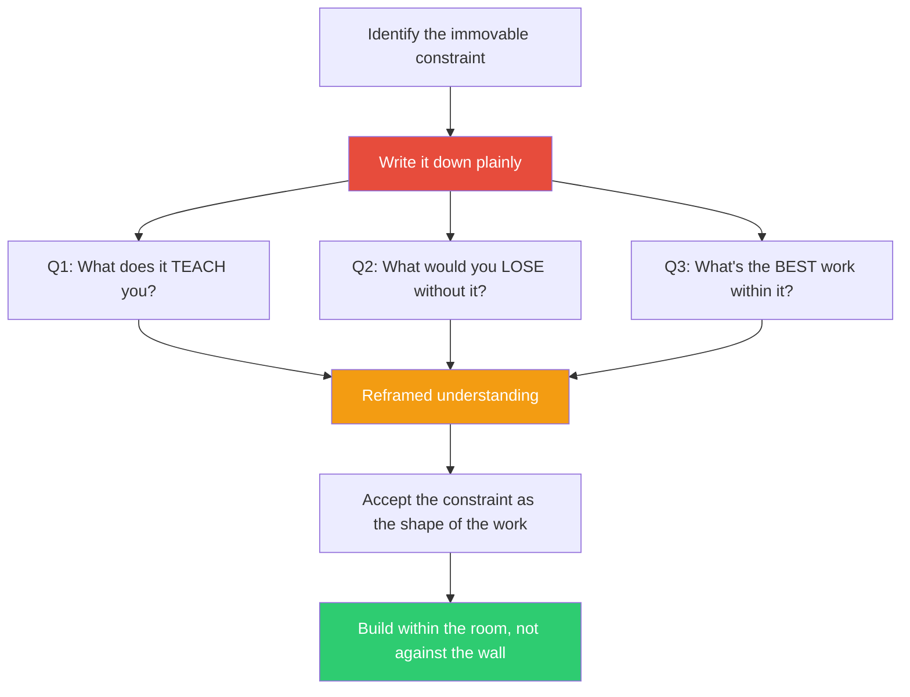

## The Move

Identify the constraint you are fighting. Write it down plainly: "We cannot change the database schema." "The deadline is in two weeks and it is not moving." "The legacy API cannot be modified." Now answer three questions. (1) What does this constraint TEACH you? What design principle, user need, or system truth is it forcing you to confront? (2) What would you LOSE if the constraint were magically removed? Every constraint also protects something — stability, backward compatibility, user expectations. (3) Given that this constraint is permanent, what is the BEST possible work you can do within it?

The third question is the one that matters. It shifts you from "fighting the wall" to "building within the room." Frankl's insight was that meaning can be found in any situation, including suffering. Your constraint is not suffering — but the principle applies: stop wishing for different circumstances and find purpose in these ones.

## When to Use

- You keep proposing solutions that require removing a constraint that will not be removed
- Frustration with a limitation is blocking your creativity
- The team is demoralized by a constraint they cannot control
- You have been stuck for a while and the stuckness is emotional, not intellectual

## Diagram

## Example

**Constraint:** "The mobile app must work offline. We cannot require an internet connection."

**Fighting the constraint (stuck state):** Every design the team proposes assumes server-side state. They keep saying "this would be so easy if we could just call the API." Two weeks of going in circles.

**Q1 — What does it teach?** It teaches us that our architecture has a hidden assumption: all truth lives on the server. The offline constraint is forcing us to think about data ownership, conflict resolution, and local-first design — problems we have been ignoring.

**Q2 — What would we lose if it were removed?** We would lose resilience. An always-online app fails when the network fails. An offline-first app works everywhere — on a plane, in a subway, in a rural area with poor connectivity. The constraint is actually a feature for our users.

**Q3 — What is the best work within it?** A CRDT-based local data store that syncs when connectivity is available. This is a harder architecture, but it produces a better product: faster local reads, no loading spinners, and resilience to network failures.

**Result:** The team stopped fighting the offline constraint and started treating it as a design principle. The resulting architecture (local-first with background sync) turned out to be faster and more reliable than the server-dependent design they had been trying to force. The constraint made the product better.

## Watch Out For

- This move is for immovable constraints, not for constraints that should be challenged. If the constraint is a bad decision that can be reversed, challenge it — do not find meaning in unnecessary suffering
- Do not use this as cope. "The legacy API is beautiful actually" is not what this move produces. Honest acknowledgment — "the legacy API is limited AND working within it teaches us to design cleaner interfaces" — is the goal
- The emotional shift matters more than the analytical output. If you are still resentful after the three questions, the constraint may need to be escalated, not accepted
- This is a snap move. Spend five minutes on the three questions. If it does not unblock you, the stuckness is not about the constraint — try a different move
